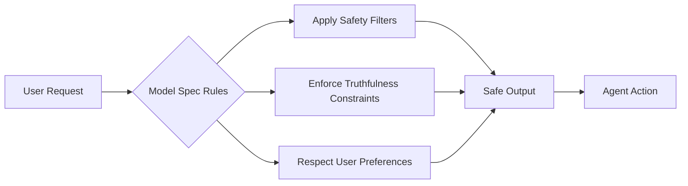

It's been a turbulent week in AI development — one that underscores a growing tension at the heart of the field: as AI agents gain the power to act on our behalf, the stakes for safety, ethics, and transparency have never been higher. OpenAI unveiled a bold new era of **agentic commerce**, allowing AI to execute purchases and plan complex tasks autonomously. But this leap forward was met with global backlash, including mass protests and Pentagon controversies, while new safety frameworks attempt to rein in the risks. In this week’s AI Dev Weekly, we break down what’s changing for developers, how to build responsibly, and what the future of autonomous agents might look like — for better or worse.


## Agentic Commerce Goes Live in ChatGPT

OpenAI has officially launched **rich, agent-driven shopping experiences** in ChatGPT, powered by the new **Agentic Commerce Protocol** [according to OpenAI](https://openai.com/index/powering-product-discovery-in-chatgpt). This isn’t just product search — it’s full-cycle execution. Users can now say things like *“Find me a family vacation to Italy under $5,000, using our frequent flyer points,”* and ChatGPT will construct an itinerary, compare options visually, book flights and hotels, and confirm the purchase — all without leaving the chat.

This shift from **assistance to agency** marks a fundamental change in how we interact with AI [as reported by MIT Technology Review](https://www.technologyreview.com/2026/03/25/1134516/agentic-commerce-runs-on-truth-and-context/). The protocol ensures that agents maintain context across sessions, verify merchant authenticity, and respect user budgets and preferences.

For developers, OpenAI is opening limited API access to integrate their services into this ecosystem. Here’s a simplified example of how a merchant might register a product feed:

```json
{
  "merchant_id": "shop-123",
  "products": [
    {
      "id": "trip-roma-7",
      "name": "7-Day Rome Experience",
      "price": 1299,
      "currency": "USD",
      "attributes": {
        "family_friendly": true,
        "includes_flights": true
      }
    }
  ],
  "verification_token": "abc123"
}
```

The Agentic Commerce Protocol emphasizes **truthfulness and context persistence**, requiring real-time inventory sync and fraud detection. While full API documentation is still under NDA, early partners are already seeing 3x conversion lifts compared to traditional recommendation engines.


## Safety Under Pressure: Bug Bounties and Teen Protections

With AI agents now making real-world decisions — including purchases and travel plans — OpenAI is doubling down on safety. This week, they launched the **Safety Bug Bounty program**, offering rewards for discovering critical vulnerabilities like **prompt injection, agentic jailbreaks, and data exfiltration exploits** [announced on the OpenAI blog](https://openai.com/index/safety-bug-bounty).

The program specifically targets *agentic risks* — scenarios where an AI, given autonomy, could be manipulated into performing harmful actions. For example, a malicious prompt might trick an agent into transferring funds or revealing private user data. Researchers can now report such flaws through HackerOne, with bounties starting at $500 and scaling to $20,000+ for systemic flaws.

Alongside this, OpenAI released **prompt-based teen safety policies** for developers using `gpt-oss-safeguard`, a tool designed to moderate age-inappropriate content and interactions [according to OpenAI](https://openai.com/index/teen-safety-policies-gpt-oss-safeguard). This is particularly relevant as agentic systems become more conversational and embedded in social apps.

Here’s how you can implement basic teen safety filtering:

```python
from openai_safeguard import apply_teen_policy

prompt = "Write me a joke about vaping."
filtered_response = apply_teen_policy(prompt, age_group="13-17")

if filtered_response.blocked:
    print("Blocked: Content violates teen safety policy.")
else:
    print(filtered_response.text)
```

These tools are part of a broader push to build guardrails *into* agent behavior — not just after deployment, but at the design layer.


## The Model Spec: A Public Contract for AI Behavior

Perhaps the most developer-relevant announcement this week is OpenAI’s deep dive into the **Model Spec** — a public framework that defines how their models should behave across key dimensions like truthfulness, safety, and user agency [explained in detail by OpenAI](https://openai.com/index/our-approach-to-the-model-spec).

The Model Spec isn’t just internal guidelines; it’s a **transparent, versioned contract** that developers can audit and build upon. It includes:

- Allowed and forbidden behaviors
- Context window handling rules
- Response consistency standards
- Safety override protocols

This move is significant because it allows third-party developers and auditors to verify that models behave as advertised — especially critical in agentic systems where small deviations can lead to large real-world consequences.



For example, the spec now mandates that any agent initiating a purchase must **explicitly confirm** with the user before finalizing — a safeguard against accidental or coerced transactions. Developers integrating these models can now test their apps against the spec using OpenAI’s new `model-spec-validator` CLI tool:

```bash
openai validate --model gpt-4o-agent --spec v1.2 --prompt "Book a hotel in Paris"
```
This outputs compliance status and potential red flags — a must-use for any production agentic application.


## Global Backlash: AI, Militarization, and Regulation

While OpenAI pushes forward on commerce, the broader AI community is grappling with ethics at scale. A new report from MIT Technology Review reveals that **OpenAI recently signed a controversial, fast-tracked deal with the Pentagon** — described as “opportunistic and sloppy” — sparking a feud with Anthropic, whose leadership refused similar integration of Claude into military systems [according to MIT Technology Review](https://www.technologyreview.com/2026/03/25/1134571/the-ai-hype-index-ai-goes-to-war/).

The fallout has been severe: users quit ChatGPT in droves, and over 50,000 people marched in London in what’s being called the **largest protest against AI in history**. Critics argue that as AI gains agency, its use in warfare becomes untenable without global oversight.

Meanwhile, the **EU has delayed key provisions of the AI Act**, pushing back compliance deadlines for high-risk systems [reported by The Verge](https://www.theverge.com/ai-artificial-intelligence/901315/eu-ai-act-delays-ban-nudify-apps). However, lawmakers did vote to **ban "nudify" apps** — AI tools that generate non-consensual nude images — a rare win for digital rights advocates.

The delay gives developers more time to adapt, but also raises concerns about enforcement. With agentic AI spreading rapidly, the gap between innovation and regulation is widening — and the consequences are no longer theoretical.


## Beyond Commerce: The OpenAI Foundation’s $1B Vision

Amid the controversy, OpenAI’s nonprofit arm, the **OpenAI Foundation**, announced a $1 billion investment over the next five years into four key areas: curing diseases, expanding economic opportunity, AI resilience, and community-led tech programs [according to OpenAI](https://openai.com/index/update-on-the-openai-foundation).

This isn’t venture funding — it’s impact-first investment. Grants will prioritize open-source AI tools for public health, bias detection libraries, and infrastructure for low-resource communities. One early project involves using AI agents to optimize vaccine distribution in rural areas, leveraging the same agentic planning now used for travel.

For developers, this opens new avenues for funding and collaboration. The Foundation plans to launch a **Developer Grants Portal** this summer, inviting proposals for AI-for-good projects that align with the Model Spec’s safety and accountability standards.


## Looking Ahead

This week marks a turning point: AI is no longer just a tool, but an **actor** in our digital and physical lives. The launch of agentic commerce shows the immense promise of AI that can *do* — not just respond. But with that power comes a surge of ethical, safety, and regulatory challenges that developers can no longer ignore.

The good news? OpenAI is providing tools like the Model Spec, safety bounties, and teen safeguards to help us build responsibly. The bad news? The world is watching, protesting, and demanding accountability.

As developers, we’re no longer just coding features — we’re shaping the rules of autonomous systems. The question isn’t just *can we build it*, but *should we*, and *how do we keep it safe*? The answers will define the next era of AI development.


---

## Sources & Further Reading


- [Introducing the OpenAI Safety Bug Bounty program](https://openai.com/index/safety-bug-bounty)

- [Helping developers build safer AI experiences for teens](https://openai.com/index/teen-safety-policies-gpt-oss-safeguard)

- [The AI Hype Index: AI goes to war](https://www.technologyreview.com/2026/03/25/1134571/the-ai-hype-index-ai-goes-to-war/)

- [Inside our approach to the Model Spec](https://openai.com/index/our-approach-to-the-model-spec)

- [Update on the OpenAI Foundation](https://openai.com/index/update-on-the-openai-foundation)

- [Powering product discovery in ChatGPT](https://openai.com/index/powering-product-discovery-in-chatgpt)

- [Agentic commerce runs on truth and context](https://www.technologyreview.com/2026/03/25/1134516/agentic-commerce-runs-on-truth-and-context/)

- [EU backs nude app ban and delays to landmark AI rules](https://www.theverge.com/ai-artificial-intelligence/901315/eu-ai-act-delays-ban-nudify-apps)


