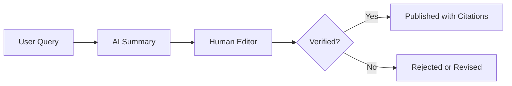
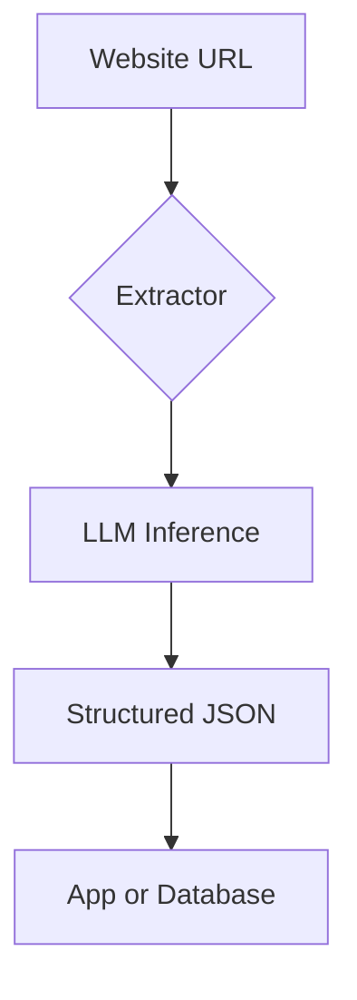

This week in AI-assisted development, the headlines are dominated not by flashy new models or coding tools, but by regulation, restraint, and responsible use. From the EU moving to ban 'nudify' apps to Wikipedia outright prohibiting AI-generated articles, the industry is grappling with the societal impact of generative AI. Meanwhile, OpenAI has paused its controversial 'adult mode' for ChatGPT, signaling a strategic retreat from high-risk applications. Yet innovation continues in more constructive areas—Webtoon is using AI to help creators reach global audiences, and a new TypeScript tool is making web extraction more robust. Let’s break down what’s changing and what it means for developers.


## EU Moves to Ban Nudify Apps, Delays Broader AI Act

In a significant development for AI regulation, the European Parliament has voted to ban 'nudify' apps—AI tools that digitally undress individuals in photos—while simultaneously delaying key compliance deadlines for the EU AI Act [according to The Verge](https://www.theverge.com/ai-artificial-intelligence/901315/eu-ai-act-delays-ban-nudify-apps). The ban passed with a large majority, reflecting growing public and political concern over AI-enabled non-consensual intimate imagery.

The delay in the AI Act’s implementation gives developers more time to comply with upcoming requirements, especially for high-risk AI systems. Originally slated for earlier enforcement, the new timeline pushes critical deadlines into 2027, allowing companies to adapt without rushed overhauls.

For developers building image-generation tools, this means:
- Implementing stricter content moderation
- Adding consent verification layers
- Auditing models for misuse potential

```ts
// Example: Detect and block banned image manipulations
if (image.metadata?.transformation === 'nudify') {
  throw new Error('Non-consensual manipulation detected');
}
```

The EU’s dual move—acting swiftly on harmful applications while pausing broader rules—shows a nuanced regulatory approach: prioritize harm reduction, then scale up governance.


## OpenAI Shelves 'Adult Mode' Amid Internal Pushback

In parallel to regulatory pressure, OpenAI has indefinitely postponed the release of a sexualized 'adult mode' for ChatGPT [as reported by The Financial Times and covered by The Verge](https://www.theverge.com/ai-artificial-intelligence/901293/openai-adult-mode-erotic-chatbot-shelved-indefinitely). The decision follows internal dissent from employees and caution from investors, who worried about reputational risk and potential misuse.

This pause aligns with OpenAI’s stated mission to ensure safe and broadly beneficial AI. It also reflects a broader industry trend: as public scrutiny increases, companies are retreating from edge-case applications that could undermine trust.

For developers working with LLMs, this reinforces the need to consider:
- Content safety policies
- User boundary enforcement
- Ethical design patterns

OpenAI’s moderation API can help filter inappropriate prompts:

```bash
# Use OpenAI moderation endpoint
curl https://api.openai.com/v1/moderations \
  -H "Authorization: Bearer $OPENAI_API_KEY" \
  -d '{"input": "Write an erotic story"}'
```

The response includes a flagged category if content violates policy—useful for pre-screening user inputs in production apps.


## Wikipedia Bans AI-Generated Articles

In a landmark move for open knowledge, Wikipedia has updated its editorial guidelines to prohibit the use of AI to write or rewrite articles [announced late last week and reported by The Verge](https://www.theverge.com/tech/901461/wikipedia-ai-generated-article-ban). The ban cites AI’s tendency to produce content that violates core policies like neutrality, verifiability, and original research.

This decision sends a strong signal: not all content automation is welcome, even in the age of LLMs. Wikipedia relies on human judgment, citation, and collaborative editing—values that current AI systems struggle to uphold.

For developers building knowledge tools or AI writing assistants, this underscores the importance of:
- Transparency in AI use
- Human-in-the-loop workflows
- Source attribution



Tools that assist rather than replace human authors are more likely to be accepted in trusted knowledge ecosystems.


## Webtoon Embraces AI for Comic Localization

Not all AI news this week is about restrictions. Webtoon, the popular comics platform, is rolling out AI-powered localization tools for its Canvas platform to help creators translate and adapt stories for global audiences [announced March 26](https://www.theverge.com/ai-artificial-intelligence/899108/webtoon-canvas-ai-translation-localization-yongsoo-kim).

The tools go beyond simple translation—they adapt cultural references, idioms, and humor to resonate with local readers, increasing engagement and monetization potential for artists.

Developers can learn from Webtoon’s approach: AI works best when it augments creative labor rather than replaces it. The platform maintains human oversight, allowing creators to review and edit AI outputs.

For teams building localization pipelines, consider integrating AI with review workflows:

```ts
// AI-powered translation with human approval
const aiTranslation = await translate(text, { targetLang: 'es' });
const editorReview = await requestEditorReview(aiTranslation);
if (editorReview.approved) {
  publish(editorReview.finalText);
}
```

This hybrid model balances scale with quality—a blueprint for ethical AI in creative industries.


## New Tool: Robust LLM Extractor for Websites

On the developer tools front, a new open-source project stands out: [**lightfeed/extractor**](https://github.com/lightfeed/extractor), a TypeScript library for extracting structured data from websites using LLMs.

Unlike brittle regex or XPath scrapers, this tool uses semantic understanding to identify and extract content—ideal for dynamic or unstructured pages.

It’s particularly useful for building AI-powered research assistants, price trackers, or content aggregators.

Install and use it with:

```bash
npm install @lightfeed/extractor
```

```ts
import { extract } from '@lightfeed/extractor';

const schema = {
  title: 'string',
  author: 'string',
  publishDate: 'string',
  content: 'string'
};

const result = await extract('https://example.com/blog-post', schema);
console.log(result);
```



This tool exemplifies the shift from rule-based scraping to AI-driven understanding—a trend we’ll see more of in 2026.


## Looking Ahead

This week reveals a pivotal moment in AI development: the field is maturing beyond 'can we build it?' to 'should we build it?'. Regulatory actions, corporate retreats, and community bans reflect a growing consensus that responsibility must guide innovation. Yet, in spaces like localization and data extraction, AI continues to empower creators and developers. The lesson? The most impactful AI tools aren’t the flashiest—they’re the ones that respect human agency, cultural context, and ethical boundaries. As developers, our job is to build systems that enhance, not exploit, the people who use them.


---

## Sources & Further Reading


- [EU backs nude app ban and delays to landmark AI rules](https://www.theverge.com/ai-artificial-intelligence/901315/eu-ai-act-delays-ban-nudify-apps)

- [OpenAI shelves erotic chatbot 'indefinitely'](https://www.theverge.com/ai-artificial-intelligence/901293/openai-adult-mode-erotic-chatbot-shelved-indefinitely)

- [Wikipedia bans AI-generated articles](https://www.theverge.com/tech/901461/wikipedia-ai-generated-article-ban)

- [Webtoon is adding AI localization tools to its comics platform](https://www.theverge.com/ai-artificial-intelligence/899108/webtoon-canvas-ai-translation-localization-yongsoo-kim)

- [Show HN: Robust LLM Extractor for Websites in TypeScript](https://github.com/lightfeed/extractor)


