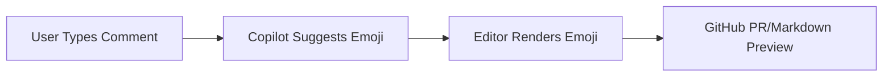

Welcome to this week’s AI Dev Weekly! The landscape of AI-assisted software development is rapidly evolving, with major advances in cybersecurity, scalable agentic workflows, and developer tooling. This edition spotlights how AI is reshaping cyber defense, how enterprises are scaling agentic automation, and takes a deep technical dive into GitHub Copilot’s new advanced emoji and Unicode support—a game-changer for documentation and code reviews.


## AI-Powered Cyber Defense: Proof of Work and Trusted Access

The arms race in AI-driven cybersecurity is heating up. OpenAI has unveiled GPT-5.4-Cyber, a model fine-tuned for defensive cybersecurity use cases, aiming to outpace threats with proactive, AI-powered defense strategies ([Simon Willison](https://simonwillison.net/2026/Apr/14/trusted-access-openai/#atom-everything)). Meanwhile, the UK’s AI Safety Institute published an independent evaluation of Anthropic’s Claude Mythos, confirming its exceptional ability to identify security vulnerabilities ([Simon Willison](https://simonwillison.net/2026/Apr/14/cybersecurity-proof-of-work/#atom-everything)).

A notable trend: cybersecurity is starting to resemble proof-of-work systems, where access and actions are increasingly gated by computational effort and AI-driven verification. For developers, this means integrating AI models into CI/CD pipelines for automated vulnerability scanning and adopting new access control paradigms. Example: integrating GPT-5.4-Cyber into a pre-merge hook for code review:

```bash
pre-commit run --all-files --hook-stage manual --model gpt-5.4-cyber
```

Expect more defensive AI models and proof-of-work-inspired controls to become standard in enterprise environments.


## Agentic Workflows at Scale: Cloudflare and OpenAI Join Forces

Enterprises are moving beyond simple LLM-powered chatbots to full agentic workflows. Cloudflare’s new Agent Cloud now integrates OpenAI’s GPT-5.4 and Codex, enabling organizations to build, deploy, and scale AI agents for real-world tasks with enterprise-grade security ([OpenAI Blog](https://openai.com/index/cloudflare-openai-agent-cloud)).

This partnership means developers can orchestrate complex, multi-step workflows—think automated incident response, codebase refactoring, or customer support—using AI agents that are both fast and secure. Example: deploying an agentic workflow with Cloudflare Agent Cloud CLI:

```bash
agent-cloud deploy --model gpt-5.4 --task incident-response.yaml
```

This shift is democratizing access to powerful automation, letting teams focus on higher-level engineering challenges.


## Feature Spotlight: Advanced Emoji and Unicode Support in GitHub Copilot

GitHub Copilot’s latest update introduces robust emoji and Unicode support in code comments and documentation ([GitHub Changelog](https://github.blog/changelog/)). For senior engineers managing multilingual codebases or leveraging visual cues in reviews, this is a significant leap forward.

**What’s New?**
- **Accurate Rendering:** Copilot now ensures emojis and Unicode characters render consistently across platforms (VS Code, GitHub web, JetBrains IDEs).
- **Intelligent Suggestions:** When writing comments or markdown, Copilot suggests relevant emojis and Unicode symbols contextually (e.g., `:warning:` for TODOs, `:rocket:` for launches).
- **Bidirectional Text Support:** Handles right-to-left scripts and mixed-language comments, crucial for global teams.
- **Markdown and Docstring Compatibility:** Emojis and Unicode are now first-class citizens in markdown files, docstrings, and READMEs.

**Why It Matters**
- **Expressive Documentation:** Visual cues like emojis make code reviews and documentation more accessible and engaging, especially for distributed teams.
- **Multilingual Support:** Unicode support means comments and docs can include non-Latin scripts without rendering issues, reducing friction for international contributors.
- **Cross-Platform Consistency:** No more broken emoji rendering between editors or platforms—what you see is what you get.

**Practical Examples**
- **Code Comments:**
  ```python
  # 🚀 Launching the new feature
  def deploy():
      ...
  ```
- **Markdown Docs:**
  ```markdown
  ## ⚠️ Known Issues
  - Some edge cases remain unhandled.
  ```
- **Multilingual Comments:**
  ```js
  // これは日本語のコメントです 📝
  // هذا تعليق باللغة العربية 🛡️
  ```

**Gotchas and Edge Cases**
- **Font Support:** Some terminals or legacy editors may still lack full Unicode/emoji font support. Copilot detects and warns about these cases, suggesting fallbacks.
- **Diffs and PRs:** Emojis in code diffs are now rendered inline on GitHub, but some third-party tools may strip or misrender them—test your workflow.
- **Linting:** Some linters may flag non-ASCII characters. Copilot can auto-insert `# noqa` or equivalent to suppress false positives.

**Composing with Other Features**
- **Copilot Chat:** You can now ask Copilot Chat to insert or explain emojis in code comments, e.g., “Add a warning emoji to all TODOs.”
- **Markdown Preview:** GitHub’s markdown preview now matches Copilot’s suggestions, ensuring WYSIWYG documentation.
- **API Integration:** The Copilot API exposes emoji/unicode suggestion endpoints, enabling custom tooling:
  ```python
  import copilot
  copilot.suggest_emoji(comment="Needs review")  # Returns: '👀'
  ```

**Best Practices**
- Use emojis for clarity, not decoration—e.g., `:bug:` for bugs, `:sparkles:` for new features.
- For multilingual teams, prefer Unicode over ASCII art for diagrams or arrows.
- Document emoji usage conventions in your CONTRIBUTING.md.

**Summary Table:**

| Use Case                | Emoji Example | Unicode Example |
|-------------------------|---------------|----------------|
| TODOs                   | 📝            | U+1F4DD        |
| Warnings                | ⚠️            | U+26A0         |
| Success/Launch          | 🚀            | U+1F680        |
| Multilingual Comments   | 🌏            | U+1F30F        |

**Mermaid Diagram: Emoji Flow in Copilot**


For more, see the [official changelog](https://github.blog/changelog/). This update is a must-try for teams aiming for expressive, accessible, and globally inclusive documentation.


## Model Selection for Claude and Codex Agents on GitHub

GitHub has rolled out model selection for Claude and Codex third-party coding agents, mirroring the flexibility of Copilot cloud agent ([GitHub Changelog](https://github.blog/changelog/2026-04-14-model-selection-for-claude-and-codex-agents-on-github-com)).

Developers can now choose the optimal model for their workflow directly from the GitHub UI, enabling fine-tuned tradeoffs between speed, cost, and accuracy. This is especially useful for large codebases or when experimenting with new agent capabilities. To select a model:

1. Go to the agent settings in your repository.
2. Choose between Claude, Codex, or Copilot, and select the desired model version.

This flexibility empowers teams to tailor their AI coding experience to project needs.


## Looking Ahead

AI is rapidly transforming the software development landscape—from smarter, more proactive cybersecurity to scalable agentic workflows and more expressive, accessible documentation. The new Copilot emoji and Unicode support is a practical leap for global teams, while model selection and agentic automation are giving developers unprecedented control and power. As these tools mature, expect even deeper integration of AI into every phase of the development lifecycle. Stay tuned, experiment boldly, and keep your workflows expressive and secure.


---

## Sources & Further Reading


- [Trusted access for the next era of cyber defense](https://simonwillison.net/2026/Apr/14/trusted-access-openai/#atom-everything)

- [Cybersecurity Looks Like Proof of Work Now](https://simonwillison.net/2026/Apr/14/cybersecurity-proof-of-work/#atom-everything)

- [Enterprises power agentic workflows in Cloudflare Agent Cloud with OpenAI](https://openai.com/index/cloudflare-openai-agent-cloud)

- [Model selection for Claude and Codex agents on github.com](https://github.blog/changelog/2026-04-14-model-selection-for-claude-and-codex-agents-on-github-com)

- [GitHub Changelog](https://github.blog/changelog/)


