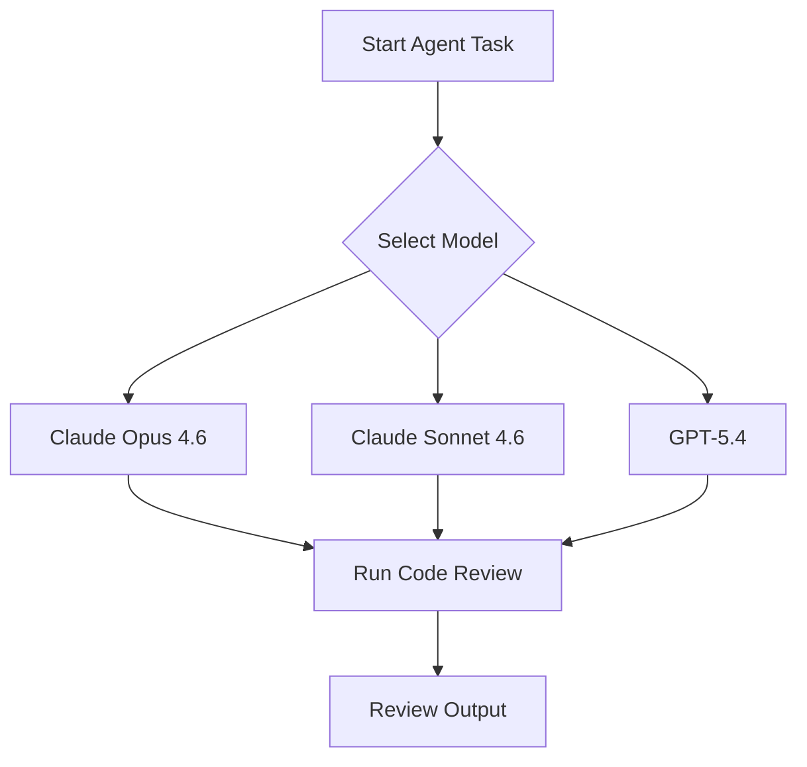

This week in AI-assisted software development, the spotlight is on practical control and security. GitHub Copilot now lets developers choose between Claude and Codex models for coding agents, giving teams new levers to optimize for speed, accuracy, and cost. Meanwhile, OpenAI and Anthropic are racing to harden LLMs for cyber defense, and Cloudflare is bringing agentic workflows to the enterprise. Let’s dive into the most actionable updates for engineering teams.


## Cybersecurity Enters the Agentic Era

The AI security arms race is heating up. OpenAI has announced a new model, GPT-5.4-Cyber, fine-tuned specifically for defensive cybersecurity use cases. This move is a direct response to Anthropic’s [Claude Mythos](https://simonwillison.net/2026/Apr/14/trusted-access-openai/#atom-everything), which recently impressed the UK’s AI Safety Institute with its ability to identify security vulnerabilities. The Institute’s [independent evaluation](https://simonwillison.net/2026/Apr/14/cybersecurity-proof-of-work/#atom-everything) found Claude Mythos exceptionally effective at surfacing real-world security issues, raising the bar for LLMs as cyber defenders.

A notable trend: cybersecurity is starting to look like proof-of-work. Instead of static rules, LLMs are being tasked with generating and validating security challenges dynamically, making it harder for attackers to automate exploits. For developers, this means integrating LLM-powered security checks into CI/CD pipelines is becoming not just possible, but practical. Expect to see more CLI tools and APIs offering hooks for LLM-based vulnerability scanning in the coming months.


## Agentic Workflows Go Enterprise-Scale

Cloudflare and OpenAI have teamed up to bring GPT-5.4 and Codex to the [Cloudflare Agent Cloud](https://openai.com/index/cloudflare-openai-agent-cloud), enabling enterprises to build, deploy, and scale AI agents for real-world tasks. This partnership means organizations can now orchestrate complex workflows—think automated code reviews, compliance checks, or incident response—using best-in-class LLMs, all with enterprise-grade security and observability.

For teams looking to get started, the Agent Cloud platform exposes a REST API and CLI for managing agent lifecycles. Example command to deploy a new agent:

```bash
cloudflare-agent deploy --model gpt-5.4 --task "review pull requests for security issues"
```

This move signals a shift: agentic workflows are no longer just a research topic—they’re becoming a core part of enterprise software delivery.


## Feature Spotlight: Model Selection for Claude and Codex Agents on GitHub.com

GitHub Copilot’s latest release brings a long-awaited feature for power users: **model selection for Claude and Codex agents** directly on GitHub.com. This update, [announced April 14, 2026](https://github.blog/changelog/2026-04-14-model-selection-for-claude-and-codex-agents-on-github-com), gives developers granular control over which LLM powers their coding agents—unlocking new strategies for optimizing speed, accuracy, and cost across different workflows.

### What’s New?
Previously, Copilot’s cloud agent would auto-select a model for you. Now, when you kick off a task with a Claude or Codex agent, you can explicitly choose from the latest Anthropic and OpenAI models:

**Claude agent options:**
- Claude Sonnet 4.6
- Claude Opus 4.6
- Claude Sonnet 4.5
- Claude Opus 4.5

**Codex agent options:**
- GPT-5.2-Codex
- GPT-5.3-Codex
- GPT-5.4

This mirrors the flexibility already available for Copilot’s own cloud agent, but now extends it to third-party LLMs. For teams with strict requirements—whether for latency, output style, or compliance—this is a game-changer.

### How to Use Model Selection
To access this feature, your organization must have Copilot Business or Enterprise, and the relevant policy for Anthropic Claude or OpenAI Codex must be enabled by an admin. Once set up, you’ll see a model selection dropdown when starting a new agent task on GitHub.com:


For CLI workflows, you can specify the model directly:

```bash
gh copilot agent run --agent=claude --model="Claude Opus 4.6" --task="refactor src/ for async"
```

Or for Codex:

```bash
gh copilot agent run --agent=codex --model="GPT-5.4" --task="generate integration tests"
```

### Practical Impact: When and Why to Switch Models
Senior engineers can now tailor agent behavior to the task:
- **Speed vs. Depth:** Use Sonnet for faster, lower-cost completions; Opus for deeper reasoning or complex refactoring.
- **Legacy vs. Latest:** If a new model introduces regressions, quickly roll back to a previous version without waiting for a global update.
- **Compliance:** Some models may be pre-approved for certain data or regions—model selection lets you enforce these boundaries at the agent level.

A typical workflow might look like this:



### Integration Tips and Gotchas
- **Policy Management:** Admins must enable third-party agent access and model selection in Copilot settings. See [GitHub docs](https://docs.github.com/en/copilot) for details.
- **Repository Ownership:** The user or org that owns the repo must enable the agent from Settings > Copilot Cloud agent.
- **API/CLI Parity:** Model selection is available both in the web UI and via the `gh` CLI, making it easy to script or automate agent runs.
- **Version Drift:** Keep an eye on model versioning—new models may behave differently on edge cases. Test critical workflows before rolling out to the whole team.

### Why This Matters
Model selection isn’t just a nice-to-have; it’s a lever for engineering velocity and risk management. Teams can now:
- Run A/B tests between models to measure code quality or review accuracy
- Optimize for cost by defaulting to Sonnet or GPT-5.2, but escalate to Opus or GPT-5.4 for high-stakes changes
- Respond quickly to model regressions or outages by switching models on demand

For organizations scaling AI-powered development, this feature brings Copilot closer to being a true platform for agentic coding—one where you control not just the prompts, but the intelligence behind them.

For more, see the [official changelog](https://github.blog/changelog/2026-04-14-model-selection-for-claude-and-codex-agents-on-github-com).


## Looking Ahead

The AI dev landscape is shifting from monolithic, one-size-fits-all tools to composable, agentic workflows where teams can fine-tune every layer—from model selection to deployment. As LLMs become core to both coding and cybersecurity, the ability to choose, test, and orchestrate models is emerging as a key engineering skill. Stay tuned: the next wave of productivity will be built on these new levers of control.


---

## Sources & Further Reading


- [Trusted access for the next era of cyber defense](https://simonwillison.net/2026/Apr/14/trusted-access-openai/#atom-everything)

- [Cybersecurity Looks Like Proof of Work Now](https://simonwillison.net/2026/Apr/14/cybersecurity-proof-of-work/#atom-everything)

- [Enterprises power agentic workflows in Cloudflare Agent Cloud with OpenAI](https://openai.com/index/cloudflare-openai-agent-cloud)

- [Model selection for Claude and Codex agents on github.com](https://github.blog/changelog/2026-04-14-model-selection-for-claude-and-codex-agents-on-github-com)


