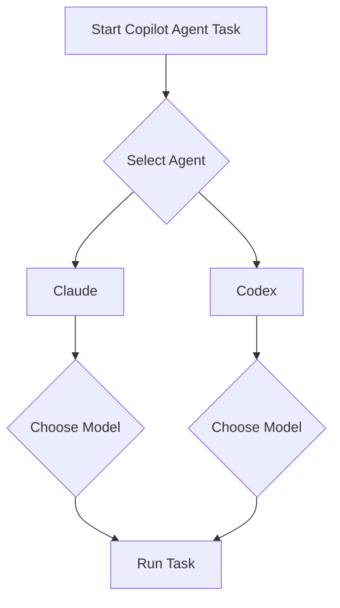

Welcome to this week’s AI Dev Weekly! The landscape of AI-assisted software development is shifting fast, with major updates that give developers more control, security, and flexibility. This week, we dive deep into GitHub Copilot’s new model selection for Claude and Codex agents, examine how AI is reshaping cybersecurity, and look at how enterprises are powering agentic workflows at scale. Let’s get into the details that matter for your daily engineering workflow.


## AI-Powered Cybersecurity: Proof of Work and Trusted Access

AI is rapidly transforming the cybersecurity landscape. The UK’s AI Safety Institute recently published an [evaluation of Claude Mythos Preview’s cyber capabilities](https://simonwillison.net/2026/Apr/14/cybersecurity-proof-of-work/#atom-everything), confirming Anthropic’s claims that it excels at identifying security vulnerabilities. This marks a shift: cybersecurity is starting to look like a 'proof of work' problem, where AI models must demonstrate their ability to defend systems before being trusted in production.

OpenAI is responding with [GPT-5.4-Cyber](https://simonwillison.net/2026/Apr/14/trusted-access-openai/#atom-everything), a model fine-tuned for defensive cybersecurity use cases. This model is designed to help organizations proactively identify and mitigate threats, setting a new bar for AI-driven cyber defense. For developers, this means integrating AI-powered security checks into CI/CD pipelines is becoming not just possible, but practical. Example:

```bash
# Example: Run AI-powered security scan in CI
openai scan --model gpt-5.4-cyber --target ./src
```

Expect to see more tools and APIs leveraging these models for automated code review, vulnerability detection, and compliance checks.


## Enterprises Scale Agentic Workflows with Cloudflare Agent Cloud

Enterprises are moving beyond simple code completion and embracing full agentic workflows. [Cloudflare’s Agent Cloud](https://openai.com/index/cloudflare-openai-agent-cloud) now integrates OpenAI’s GPT-5.4 and Codex, enabling organizations to build, deploy, and scale AI agents for real-world tasks with speed and security. This means you can orchestrate complex, multi-step workflows—like automated incident response or infrastructure provisioning—using AI agents as first-class citizens in your cloud stack.

A typical workflow might look like:

```yaml
# Example: Agentic workflow definition
steps:
  - name: Detect incident
    uses: openai/gpt-5.4-cyber
  - name: Triage
    uses: openai/codex
  - name: Remediate
    uses: custom/infra-agent
```

This shift is making it easier for engineering teams to automate operational tasks, reduce manual toil, and respond to incidents faster.


## Feature Spotlight: Model Selection for Claude and Codex Agents on GitHub.com

On April 14, 2026, GitHub rolled out a highly anticipated feature: [model selection for Claude and Codex agents on github.com](https://github.blog/changelog/2026-04-14-model-selection-for-claude-and-codex-agents-on-github-com). This update gives developers explicit control over which LLM powers their Copilot agent tasks, bringing a new level of transparency and flexibility to AI-assisted coding.

**What Changed?**
Previously, Copilot’s cloud agent would select a model behind the scenes. Now, when you use Claude or Codex third-party coding agents, you can choose from a menu of available models at task kickoff. For Claude, you can select from:
- Claude Sonnet 4.6
- Claude Opus 4.6
- Claude Sonnet 4.5
- Claude Opus 4.5

For Codex, the options are:
- GPT-5.2-Codex
- GPT-5.3-Codex
- GPT-5.4

This mirrors the flexibility already available for Copilot’s own cloud agent, and means you can always access the latest and most capable models as soon as they’re released.

**Why It Matters for Senior Engineers**
Model selection isn’t just a nice-to-have—it’s a practical lever for:
- **Performance tuning:** Some models are faster, others more accurate. For large codebases or time-sensitive tasks, you can now optimize for your needs.
- **Cost control:** Newer models may be more expensive. Teams can default to a cheaper model for routine tasks and switch to a premium one for critical reviews.
- **Reproducibility:** By pinning a model version, you ensure consistent results across runs and team members—crucial for regulated environments or debugging tricky issues.
- **Experimentation:** Want to compare how Claude Opus 4.6 and GPT-5.4 handle a tricky refactor? Now you can, side by side.

**How to Use It**
To enable model selection:
1. Ensure your organization has enabled access to third-party coding agents (Claude and Codex) via Copilot settings.
2. When starting a Copilot agent task, you’ll see a dropdown or config option to pick your desired model.

Example workflow:



**Config Snippet:**

```yaml
# .github/copilot-agent.yml
agent: "claude"
model: "claude-opus-4.6"
```

**Gotchas and Edge Cases**
- **Policy Requirements:** For business or enterprise users, your admin must enable the relevant policy for Anthropic Claude or OpenAI Codex. See [Managing policies and features for GitHub Copilot in your enterprise](https://docs.github.com/en/copilot) for details.
- **Repository Settings:** The user or org that owns the repo must enable the agent from Settings > Copilot Cloud agent.
- **Model Availability:** Not all models may be available in every region or subscription tier. Check the dropdown for your options.
- **API/CLI Support:** As of this release, model selection is available via the GitHub.com UI and YAML config. CLI/API support may follow—watch the [GitHub Changelog](https://github.blog/changelog/2026-04-14-model-selection-for-claude-and-codex-agents-on-github-com) for updates.

**Composing with Other Features**
Model selection works seamlessly with other Copilot features:
- **Data residency:** Pin a model and region for compliance.
- **Usage metrics:** Track which models are used most across your org.
- **Merge conflict resolution:** Try different models for automated merges and compare results.

**Practical Example**
Suppose you’re reviewing a security-critical PR and want the most advanced reasoning. You’d select Claude Opus 4.6 for the agent:

```yaml
agent: "claude"
model: "claude-opus-4.6"
```

For a quick code cleanup, you might use GPT-5.2-Codex for speed and cost efficiency:

```yaml
agent: "codex"
model: "gpt-5.2-codex"
```

**Bottom Line**
This feature gives senior engineers the control they’ve been asking for—no more black-box model selection. It’s a major step toward making AI coding agents a transparent, tunable part of the modern development workflow. For more, see the [official changelog](https://github.blog/changelog/2026-04-14-model-selection-for-claude-and-codex-agents-on-github-com).


## Looking Ahead

The AI-assisted development world is moving toward greater transparency, control, and security. With model selection for Copilot agents, fine-tuned cybersecurity models, and scalable agentic workflows, senior engineers now have the tools to shape AI’s role in their stack. The next wave will be about composability—how these features work together to automate, secure, and accelerate software delivery. Stay tuned, and keep experimenting with these new capabilities to stay ahead.


---

## Sources & Further Reading


- [Trusted access for the next era of cyber defense](https://simonwillison.net/2026/Apr/14/trusted-access-openai/#atom-everything)

- [Cybersecurity Looks Like Proof of Work Now](https://simonwillison.net/2026/Apr/14/cybersecurity-proof-of-work/#atom-everything)

- [Enterprises power agentic workflows in Cloudflare Agent Cloud with OpenAI](https://openai.com/index/cloudflare-openai-agent-cloud)

- [Model selection for Claude and Codex agents on github.com](https://github.blog/changelog/2026-04-14-model-selection-for-claude-and-codex-agents-on-github-com)


