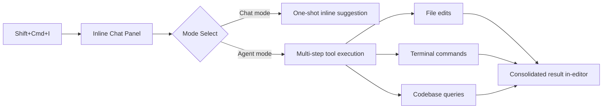

This week, the AI dev tooling landscape shifted on multiple fronts simultaneously. OpenAI's GPT-5.5 went from preview to broadly available — landing in GitHub Copilot, the `llm` CLI, and a detailed prompting guide from OpenAI itself. Meanwhile, Anthropic published a rare, candid postmortem admitting it had quietly degraded Claude Code's reasoning quality to reduce latency — and that users noticed immediately. And GitHub shipped inline agent mode for JetBrains IDEs, a change that sounds incremental but represents a meaningful shift in how autonomous AI reasoning integrates into daily coding workflows. This issue covers all three.


## GPT-5.5 Lands Across the Dev Stack

OpenAI's GPT-5.5 is now generally available in the API, and the ecosystem has moved fast to integrate it. [GitHub Copilot rolled it out on April 24](https://github.blog/changelog/2026-04-24-gpt-5-5-is-generally-available-for-github-copilot), noting in early testing that it delivers its strongest gains on complex, multi-step agentic coding tasks. If you are using Copilot for anything beyond single-function completions — think cross-file refactors, issue-to-PR workflows, or code review summarization — GPT-5.5 is the model to test first.

Simon Willison's [llm 0.31](https://simonwillison.net/2026/Apr/24/llm/#atom-everything) ships same-day support with `llm -m gpt-5.5`. Two new options are worth knowing: `-o verbosity low` controls how much text the model generates for GPT-5+ models (values: `low`, `medium`, `high`), and `-o image_detail low` adjusts detail level for image attachments. Verbosity control is particularly useful when piping output into scripts or chaining with other CLI tools where verbose prose is noise:

```bash
# Quick code review with controlled output
llm -m gpt-5.5 -o verbosity low "Review this for security issues" < auth.py

# Image analysis with low detail (faster, cheaper)
llm -m gpt-5.5 -o image_detail low -a screenshot.png "What is wrong with this UI?"
```

OpenAI also published a [prompting guide specifically for GPT-5.5](https://simonwillison.net/2026/Apr/25/gpt-5-5-prompting-guide/#atom-everything) alongside the API launch, covering techniques for applications that may spend significant time in reasoning before returning a user-visible response — a practical concern for anyone building agentic pipelines where latency compounds across tool calls.


## Anthropic's Claude Postmortem: A Lesson in Model Governance

On April 23, Anthropic published a [detailed postmortem](https://www.anthropic.com/engineering/april-23-postmortem) that stands out for its directness: on March 4, the team changed Claude Code's default reasoning effort from `high` to `medium` to address latency complaints — some users were seeing the UI appear frozen while the model worked through complex prompts. The reasoning made internal sense. The outcome did not.

Users immediately noticed the quality regression and said clearly they preferred the slower, higher-quality response. Anthropic reverted the change on April 7. The postmortem is worth reading in full not because the mistake was unusual, but because it maps onto a structural challenge every team building on hosted AI APIs faces: you do not control model behavior between versions, and the vendor's latency-quality tradeoffs may not match your users' preferences.

This lands alongside a broader [wave of user frustration with Claude's consistency](https://nickyreinert.de/en/2026/2026-04-24-claude-critics/), with developers citing token-level issues and declining quality as reasons to cancel subscriptions. The r/LocalLLaMA thread amplifying Anthropic's postmortem frames it as validation for local model investments — the argument being that self-hosted, open-weight models do not silently degrade between deployments.

The practical takeaway for teams building production systems on Claude: pin to specific model versions where possible, add automated regression tests against a fixed golden set of prompts, and treat hosted model updates as you would any dependency update — something that requires validation before it reaches your users.


## Feature Spotlight: Inline Agent Mode in GitHub Copilot for JetBrains IDEs

The gap between inline chat and agent mode has been one of the defining friction points in AI-assisted development inside JetBrains IDEs. Traditional inline chat was a one-shot interaction: describe a change, receive a diff, accept or reject. Agent mode, by contrast, plans and executes a sequence of tool calls — editing files, running terminal commands, querying the codebase — before surfacing results. That power was previously locked behind the chat panel, which meant leaving your editor context, opening a conversation thread, and navigating back. For complex tasks anchored to a specific file or function, this context-switching was a persistent source of friction.

The [April 24 changelog](https://github.blog/changelog/2026-04-24-inline-agent-mode-in-preview-and-more-in-github-copilot-for-jetbrains-ides) closes that gap. Inline agent mode is now in public preview, bringing multi-step autonomous reasoning into the existing inline chat experience. The entry point is the same keyboard shortcut you already use — `Shift+Ctrl+I` on Windows or `Shift+Cmd+I` on Mac. You can also right-click in the editor and choose **Open Inline Chat**, or click the gutter icon and select **Inline Chat**. Once the panel opens, switch to agent mode inside it. No new shortcut to memorize, no new panel to discover.



The workflow difference is subtle but operationally significant. When you are deep in a refactor, the agent stays anchored to your editor position and can reason about the surrounding code without you copying context into a separate panel. For focused, location-anchored tasks — extracting a method and updating its callers in the same file, diagnosing a null-safety failure in context, or adding tests directly below the function under test — this removes the most disruptive part of the existing agentic workflow.

Inline agent mode is best thought of as a complement to chat-panel agents rather than a replacement. Chat-panel agent mode handles broad, project-spanning work: migrating all usages of a deprecated API across the repository, or scaffolding an integration test suite for a module. Inline agent mode is optimized for tasks that are spatially specific — tasks where you are looking at the code in question and want the agent working in that exact context. The tighter scope also tends to reduce hallucinations on unrelated code, since the agent's initial context window centers on what is currently visible in the editor.

Controlling what the agent approves autonomously is a critical operational decision this release makes more nuanced. Global auto-approve, available at `Settings → GitHub Copilot → Chat → Auto Approve → Global Auto Approve`, approves every tool call — file edits, terminal commands, external tool calls — across all workspaces, overriding per-category rules. The changelog is explicit about the risk. For most production workflows, this is the wrong choice: a misconfigured prompt or a subtle hallucination in a shell command becomes immediately destructive with no review gate. Reserve it for throwaway sandboxes or fully version-controlled codebases where speed is the priority.

The two new granular controls added in this release are more practical:

- **Auto-approve commands not covered by rules** — unmatched terminal commands run without prompting
- **Auto-approve file edits not covered by rules** — same for file edits

Both live at `Settings → GitHub Copilot → Chat → Auto Approve`. The design logic is rule-based allowlisting: you create explicit rules permitting safe, idempotent commands — `npm test`, `cargo check`, `python -m pytest`, `git diff` — while unmatched commands fall through to whatever the granular default says. This composability lets you build a genuinely useful automation loop without a blanket approval policy. A practical baseline for a typical backend service: auto-approve test runners and formatters, require manual review for anything touching dependency manifests, environment files, or network calls.

```
Settings > GitHub Copilot > Chat > Auto Approve
├── Global Auto Approve                              ← off unless you accept full risk
├── Auto-approve commands not covered by rules       ← safe for known-clean codebases
└── Auto-approve file edits not covered by rules     ← combine with specific allow rules
```

Two Next Edit Suggestions enhancements ship in the same update. Inline edit previews now render proposed changes as inlay hints directly in the editor before you accept — meaning you evaluate the suggestion surrounded by the code it modifies, not in a detached diff panel. The cognitive overhead of cross-referencing a panel with your cursor position is real at high velocity, and inlay previews reduce it meaningfully.

The second enhancement addresses far-away edits — situations where NES proposes a change several screens from your cursor. A gutter direction indicator now appears showing which way to scroll, with a quick-jump action attached. Anyone who has accepted a suggestion and then hunted for the companion edit in a large file will recognize the value immediately. To enable NES: `Settings → GitHub Copilot → Completions → Enable Next Edit Suggestions`.

One important note for teams on Copilot Business or Enterprise plans: these preview features are not available until an administrator enables the **Editor preview features** policy. That gating step can silently block individual developers from accessing features that have shipped — worth flagging to whoever manages your organization's Copilot settings before developers start wondering why the changelog does not match their IDE.

The UX improvements bundled in this release — chat context resetting after messages, improved rendering performance for large conversation histories, auto-resizing inline code review panels, a smoother device code login flow — suggest that GitHub is treating JetBrains as a first-class surface rather than an afterthought. As inline agent mode matures from preview to GA, these polish details matter: an agentic workflow that crashes on a large conversation history or requires multiple login attempts is one developers will abandon.


## Looking Ahead

Three threads connect this week. GPT-5.5's rapid, coordinated ecosystem integration — same-day support across Copilot, the llm CLI, and OpenAI's own documentation — signals an industry that has gotten meaningfully better at rolling out capable models quickly. The verbosity and reasoning controls appearing in these integrations point toward a future of more granular, developer-controlled inference rather than one-size-fits-all defaults.

Anthropic's postmortem is a case study in what transparent model governance looks like and why it matters. The mistake was predictable; the public acknowledgment was not. As more teams build critical workflows on hosted AI APIs, the industry needs more of this — documented change logs, explicit reasoning about quality-latency tradeoffs, and fast reversions when users push back. Teams on the receiving end should respond by treating LLM providers more like third-party dependencies: version-pinned, regression-tested, and monitored for behavioral drift.

Inline agent mode in JetBrains points toward the near-term future of IDE-native AI: not a chatbot living in a side panel, but an embedded reasoning engine operating in context, subject to explicit, auditable approval policies. As these controls mature and models become more reliable at scoped tool use, the boundary between "AI suggestion" and "AI action" will continue to shift. The developers who build good habits around verification and rule-based automation now will be better positioned when that boundary moves further.


---

## Sources & Further Reading


- [GPT-5.5 prompting guide — Simon Willison](https://simonwillison.net/2026/Apr/25/gpt-5-5-prompting-guide/#atom-everything)

- [GPT-5.5 is generally available for GitHub Copilot](https://github.blog/changelog/2026-04-24-gpt-5-5-is-generally-available-for-github-copilot)

- [llm 0.31 release — Simon Willison](https://simonwillison.net/2026/Apr/24/llm/#atom-everything)

- [Anthropic April 23 postmortem](https://www.anthropic.com/engineering/april-23-postmortem)

- [I cancelled Claude: Token issues, declining quality, and poor support](https://nickyreinert.de/en/2026/2026-04-24-claude-critics/)

- [Inline agent mode in GitHub Copilot for JetBrains IDEs](https://github.blog/changelog/2026-04-24-inline-agent-mode-in-preview-and-more-in-github-copilot-for-jetbrains-ides)


