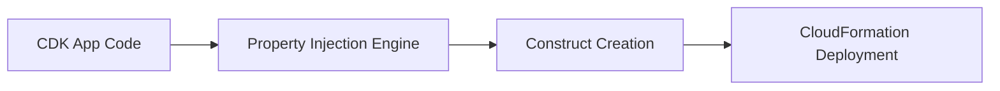

AI-driven developer tools continue to transform core workflows, not just in how we write code, but how we standardize, secure, and scale practices across organizations. This week we examine the general availability of secret scanning within GitHub MCP, the emergence of enterprise-managed Copilot CLI plugins, upcoming language model deprecations, and a technical spotlight on AWS CDK Property Injection—a feature that quietly solves one of the thorniest issues in infrastructure-as-code: consistent resource configuration. Let's dig in.


## GitHub MCP Secret Scanning Now Generally Available

GitHub has announced [general availability](https://github.blog/changelog/2026-05-05-secret-scanning-with-github-mcp-server-is-now-generally-available) of secret scanning integrated with the Model Context Protocol (MCP) server. This means that AI coding agents and IDEs supporting MCP—such as GitHub Copilot CLI and Copilot Chat—can now tap into real-time secret scanning workflows. For developers, this provides an immediate security feedback loop during code generation and agent-assisted editing, helping prevent accidental leakage of credentials. 

Secret scanning works seamlessly: as an agent or CLI submits generated code to the MCP server, secret patterns (API tokens, private keys, etc.) are automatically detected and flagged. You won't need additional manual setup—just ensure your agent is MCP-compatible. A typical workflow within Copilot CLI might look like:

```bash
gh copilot agent generate --target ./src
```

Secrets found are surfaced as actionable warnings, allowing developers to correct issues on the spot rather than after code is merged. This closes a gap for teams relying on AI generation, where context windows might miss subtle but dangerous token exposures during iterative prompts. Enterprises benefit especially, as this feature can be rolled out organization-wide without changing agent usage patterns, strengthening compliance and audit posture for AI-generated code.

The integration of secret scanning with MCP is a reminder: as we automate more with coding agents, ambient security checks are indispensable. For further details on rollout and supported agents, see the [GitHub Changelog announcement](https://github.blog/changelog/2026-05-05-secret-scanning-with-github-mcp-server-is-now-generally-available).


## Enterprise-Managed Plugins in GitHub Copilot CLI: Control and Consistency

Another major leap from GitHub: [enterprise-managed plugins](https://github.blog/changelog/2026-05-06-enterprise-managed-plugins-in-github-copilot-cli-are-now-in-public-preview) for Copilot CLI have entered public preview, opening up centralized control for plugin distribution.

This feature lets enterprise administrators curate, configure, and roll out CLI plugins across entire organizations, ensuring baseline standards and consistent tooling. Previously, plugin management was a free-for-all—users installed what they liked, risking fragmentation, version sprawl, and inconsistent practices. Now, admins can define a standard plugin set (linting, formatters, compliance helpers, etc.) and distribute it to all Copilot CLI users, propagating upgrades and policy changes from one central location.

For developers, the workflow is unchanged except for increased plug-in availability and policy enforcement. Admins set plugin standards via infrastructure-as-code or portal interfaces, such as:

```bash
gh copilot cli plugin sync --enterprise
```

This ensures every team member stays up-to-date with required tools, saving time on onboarding and maintenance. Coupled with MCP secret scanning, enterprise plugin control signals a shift towards treating AI coding agents as first-class citizens in compliance and operational toolchains. Read more in the [GitHub Changelog](https://github.blog/changelog/2026-05-06-enterprise-managed-plugins-in-github-copilot-cli-are-now-in-public-preview).

The roadmap here ties directly to AI agent security and operational trust—expect integrations like plugin-based trust layers or policy enforcement for generative code agents soon.


## Feature Spotlight: Property Injection for Standardizing CDK Construct Properties

Across organizations leveraging AWS Cloud Development Kit (CDK), consistent infrastructure configuration is a perennial headache. Teams must ensure every construct adheres to security, compliance, and operational requirements—but the scale of manual configuration grows unmanageable as repositories proliferate. Even with custom construct libraries, one-off settings and code drift can creep in, threatening audit readiness and operational safety.

The [Property Injection](https://aws.amazon.com/blogs/devops/standardizing-construct-properties-with-aws-cdk-property-injection/) feature, introduced in AWS CDK v2.196.0, offers a transformative approach: automatic, zero-impact enforcement of property standards across all constructs, without refactoring existing code. Let's break down its real-world practicalities and workflow for senior engineers.

## The Problem: Manual Configuration Drift

Take a classic example—the need to enforce security policies for all `SecurityGroup` resources, like disabling outbound traffic. Prior to Property Injection, teams would have to explicitly set `allowAllOutbound: false` and `allowAllIpv6Outbound: false` everywhere, risking missed properties and inconsistent enforcement:

```typescript
new SecurityGroup(stack, 'api-sg', {
  vpc: myVpc,
  allowAllOutbound: false, // required
  allowAllIpv6Outbound: false // required
});
new SecurityGroup(stack, 'db-sg', {
  vpc: myVpc,
  allowAllOutbound: false, // repeated
  allowAllIpv6Outbound: false // repeated
});
```

Policy changes meant combing through every instantiation, often across dozens of repos. Custom wrappers forced painful refactoring and made onboarding harder.

## Property Injection: Translucent, Centralized Standards

With Property Injection, you define defaults once—centrally—and the CDK engine applies them automatically to relevant constructs. This happens transparently, requiring zero changes to developer code. Existing infrastructure definitions remain untouched, with organizational standards invisibly layered on top:

```typescript
new SecurityGroup(stack, 'my-sg', {
  vpc: myVpc // Organizational defaults applied by Property Injection
});
```

The workflow starts with defining your injection policies in a central location, usually tied to a CDK policy provider or plugin:

```javascript
// Example: Register property injection for SecurityGroup
import { PropertyInjection } from 'aws-cdk-lib/property-injection';

PropertyInjection.register(SecurityGroup, {
  allowAllOutbound: false,
  allowAllIpv6Outbound: false
});
```

From this point forward, ALL instances of `SecurityGroup` within your CDK app (or organization, depending on integration) inherit these properties unless specifically overridden. Policy updates are as simple as editing this central definition, vastly reducing maintenance overhead.

## Non-Obvious Behavior and Composition

Certain nuances stand out for experienced teams:
- **Override Mechanics:** Explicit settings in a construct instantiation still take precedence, so you retain flexibility for exceptions where needed.
- **Zero-Impact Adoption:** The feature operates under the hood, without breaking existing project structures, so migration is largely painless.
- **Composing with Custom Constructs:** Property Injection works with standard CDK constructs. Wrappers and custom constructs might require opt-in, so review API documentation when extending.
- **Scope and Granularity:** Policies can be targeted to resource types or scoped at project/organization level, fitting various compliance strategies.

Here's how the property injection mechanism fits into a typical CDK pipeline:



## Practical Impact and Policy Update Workflow

The real power emerges during operational changes. Suppose your security team updates requirements—maybe now all `SecurityGroup` resources must tag resources for audit tracking. With Property Injection, you simply adjust the central definition:

```javascript
PropertyInjection.register(SecurityGroup, {
  allowAllOutbound: false,
  allowAllIpv6Outbound: false,
  tags: { Audit: '2026' }
});
```

Developers instantly benefit: new, consistent properties flow into every resource without tedious manual patching. Compliance is provable—construct definitions match policy, and drift is minimized.

## Rollout and Edge Cases

For senior engineers orchestrating policy rollout:
- Start by auditing current construct instantiations, identifying where property injection will bring immediate value.
- Integrate property injection registration scripts into your CDK bootstrap/config code.
- Monitor for unexpected overrides or gaps, especially for custom resources or third-party libraries. Property Injection is designed for minimal breakage, but edge cases in composability might arise in bespoke constructs.
- Centralize policy definitions and communicate with platform and security teams to align standards.

You can follow detailed API references and pattern examples in the [AWS DevOps blog](https://aws.amazon.com/blogs/devops/standardizing-construct-properties-with-aws-cdk-property-injection/).

The net result: Infrastructure as code (IaC) practices evolve towards automated consistency, compliance, and zero cognitive tax on developers. Property Injection is poised to become a default for large-scale CDK deployments where operational standards must scale without friction or drift.


## Model Deprecation and Agentic Trust Layers: Keeping AI Coding Secure and Reliable

GitHub has confirmed [deprecation](https://github.blog/changelog/2026-05-01-upcoming-deprecation-of-gpt-5-2-and-gpt-5-2-codex) of GPT-5.2 and GPT-5.2-Codex models for Copilot experiences, reflecting the rapid evolution in LLM platforms. For developers, this means future Copilot Chat, inline editing, and code completions may rely solely on newer models—forcing updates to workflows, prompt tuning, and expectation calibration. Those dependent on GPT-5.2-Codex should note its limited extension and test compatibility now.

Meanwhile, [trust-layer strategies](https://github.blog/ai-and-ml/generative-ai/validating-agentic-behavior-when-correct-isnt-deterministic/) for agentic coding are progressing. GitHub’s dominatory analysis allows teams to validate agentic behavior (where “correct” is not deterministic) without brittle scripts or opaque judgement. This helps ensure that generative AI agents behave as intended, without relying on static test cases or human re-evaluation—crucial for secure, scalable agentic systems that must meet nuanced requirements.

As LLM platforms evolve and trust layers mature, the trend is clear: automation and agent-driven workflows are only as strong as the reliability and accountability mechanisms built around them.


## Looking Ahead

AI coding agents, infrastructure automation, and enterprise controls are converging toward a future where compliance, consistency, and velocity are not trade-offs but standard outcomes. With secret scanning integrated directly into agent workflows, enterprise plugin orchestration, and property injection automating standards for AWS CDK, senior developers can focus more on solving business problems and less on manual configuration and security patching. As agentic trust layers and model deprecations continue apace, teams should keep toolchains nimble, review automated policy enforcement, and prepare for a landscape where invisible guardrails quietly keep codebases secure and compliant. Expect more features that blend AI with central policy control, and more ways for engineers to shape the balance of automation and trust.


---

## Sources & Further Reading


- [Secret scanning with GitHub MCP Server is now generally available](https://github.blog/changelog/2026-05-05-secret-scanning-with-github-mcp-server-is-now-generally-available)

- [Enterprise-managed plugins in GitHub Copilot CLI are now in public preview](https://github.blog/changelog/2026-05-06-enterprise-managed-plugins-in-github-copilot-cli-are-now-in-public-preview)

- [Upcoming deprecation of GPT-5.2 and GPT-5.2-Codex](https://github.blog/changelog/2026-05-01-upcoming-deprecation-of-gpt-5-2-and-gpt-5-2-codex)

- [Validating agentic behavior when 'correct' isn't deterministic](https://github.blog/ai-and-ml/generative-ai/validating-agentic-behavior-when-correct-isnt-deterministic/)

- [Standardizing construct properties with AWS CDK Property Injection](https://aws.amazon.com/blogs/devops/standardizing-construct-properties-with-aws-cdk-property-injection/)


