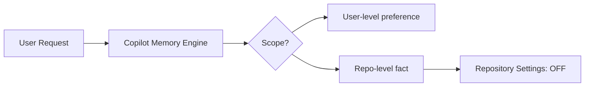
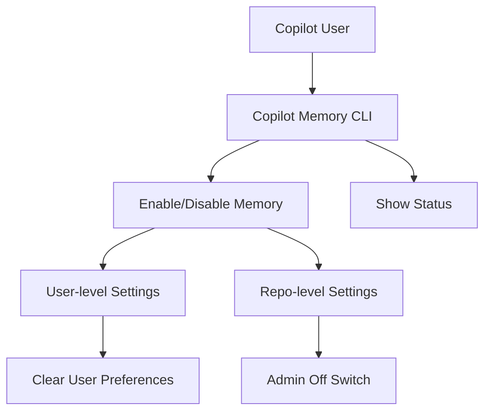

This week, the AI-assisted development world saw rapid advances: Claude Opus 4.8's release and integration with GitHub Copilot, OpenAI's push into biodefense, and major improvements to Copilot Memory. These stories signal not just technical leaps, but a transformation in the daily workflow and operational control for engineering teams. Let's break down what's new, why these features matter, and how you can put them to work.


## Claude Opus 4.8: Model Leap and Practical Integration

Anthropic's latest flagship, Claude Opus 4.8, is now live and setting fresh benchmarks for code generation and understanding, with broad developer access [announced officially](https://www.anthropic.com/news/claude-opus-4-8). According to the [GitHub Changelog](https://github.blog/changelog/2026-05-28-claude-opus-4-8-is-generally-available-for-github-copilot), Opus 4.8 brings a notable jump in programming context retention, refactoring intelligence, and test generation. 

For devs using Copilot, this means fewer hallucinations and a tighter fit to your project conventions. As seen in early integrations, Opus 4.8 parses complex diff histories and multi-file code requests with improved semantic understanding.

If you're running your own workflows with [llm-anthropic](https://simonwillison.net/2026/May/28/llm-anthropic/#atom-everything), update to 0.25.1 to access Claude Opus 4.8 directly:

```shell
llm -m claude-opus-4.8 "Refactor authentication in auth.py"
```

High-volume teams can now leverage the `-o fast` flag for speed, and take advantage of an updated max_tokens default to work against larger code blocks. These quality-of-life tweaks reduce manual configuration, letting you focus more on code and less on infrastructure.


## Product-Market Fit: AI Coding Tools Go Mainstream

As [Simon Willison observed](https://simonwillison.net/2026/May/27/product-market-fit/#atom-everything), rumors are swirling of Anthropic's imminent profitability—a consequence of widespread, high-frequency team adoption. Stories abound of ballooning enterprise LLM bills due to heavy tool usage, underscoring how deeply Copilot and Claude have become central to developer workflows. 

This signals a shift: teams are moving from experimental AI integration to full-blown reliance. The daily engineering routine is changing and AI is now a fundamental, operational layer, not just a novelty. Developers should watch usage analytics and prepare for optimized model selection and efficient prompt engineering as bills scale.


## OpenAI Launches Rosalind Biodefense: AI for Societal Resilience

OpenAI has launched [Rosalind Biodefense](https://openai.com/index/strengthening-societal-resilience-with-rosalind-biodefense), expanding trusted GPT access to vetted developers and U.S. government partners. The goal is clear: enable frontier AI to boost biodefense, public health, and pandemic readiness by providing domain-adapted tools.

While not immediately relevant to all dev teams, it's a signal that LLMs are evolving beyond software use. If you're working in health, risk, or government-adjacent fields, Rosalind could soon reshape your data pipelines and analytical tools. Watch for API releases and program partnership opportunities.


## Feature Spotlight: Copilot Memory Controls for Deletion, Scope, and CLI

With Copilot Memory's latest public preview update, developers now wield advanced controls over how AI retains, scopes, and forgets code context—offering unprecedented control in collaborative and sensitive environments [as detailed in the official changelog](https://github.blog/changelog/2026-05-26-copilot-memory-has-more-controls-for-deletion-scope-and-the-copilot-cli).

**Workflow Shift**

Previously, Copilot Memory passively learned from your edits, storing snippets and project facts. Now, you decide exactly what should enter or exit its context cache. Practical impact? Sensitive API keys, proprietary logic, or deprecated code can be excised from memory at will—without wading through multiple menus or risking accidental retention across repositories.

**Memory Deletion Made Explicit**

When you ask Copilot to forget something—whether via prompt or in-app—the system now guides you to the relevant memory zone and down-votes that memory (where voting is possible). This creates a feedback loop lowering recurrence of unwanted suggestions. Consider this scenario:

```shell
# In Copilot Chat
"Forget the AWS credentials from utils/aws_keys.py"
```

You will be pointed to the right setting panel or repository configuration, with explicit guidance instead of a silent fail or unnoticed retention. Organizationally, this closes compliance gaps and raises developer confidence.

**Repository-Level Scope and Off Switch**

Admins can now *disable* Copilot Memory for an entire repository. The toggle lives within "Repository Settings -> Copilot Memory", providing clear boundaries between user-level and organization-level facts.



This means if a repo holds sensitive or legacy code, you can instantly halt memory accrual. Note: preexisting facts aren't retroactively deleted—so you must explicitly clear them in settings. User preferences persist unless individually deleted—giving engineers personal control while teams wield broader governance.

**Copilot CLI: Real Session Management**

Perhaps the most developer-centric new feature: Copilot Memory can now be toggled and queried from the command line using the Copilot CLI—integrating smoothly into Bash scripts, CI/CD flows, and as part of ephemeral coding sessions.

Here's how it works:

```shell
copilot /memory on    # Enable Copilot Memory
copilot /memory off   # Disable Copilot Memory for this session
copilot /memory show  # Check current Memory status
```

This status persists across sessions. For example, in a CI/CD pipeline running sensitive deployment logic, you can precede build scripts with:

```shell
copilot /memory off
```

to ensure nothing is stored or surfaced in subsequent suggestions.

**Explicit Capture Prompts: No More Guesswork**

When storing new facts, Copilot will now prompt you to confirm whether the entry is user-level (private) or repo-level (shared). This avoids accidental leakage, e.g., when capturing environment-specific values. At each memory capture, the scope is clear, matching the permission model to the developer’s intent.

**Edge Cases and Composition**

There are non-obvious impacts on memory composition: if you turn off Copilot Memory for a repo, user-level preferences still apply in your workspace. To fully clear a context, you must address both layers. For complex cross-repo projects, this means scoping memory with precision—deleting, toggling, or reviewing in both the personal settings menu and repo controls. 

Here's a practical workflow for managing Copilot Memory while refactoring code:

```shell
# Review user-level memory
copilot settings memory

# Edit repository-level facts
# In GitHub web UI: Repository Settings > Copilot Memory
```

Combine CLI toggles with in-app settings for optimal control.

**Architecture View**

Below, a diagram illustrates Copilot Memory’s new controls and their interaction points:



**Impact on Developer Workflow**

With granular deletion, scope prompts, and CLI session management, Copilot Memory bridges the gap between individual privacy and collaborative code intelligence. Engineers in regulated sectors, open-source maintainers, and high-velocity product teams gain full transparency and operational control. No more second-guessing what your AI knows, where it stores it, or who can see it.

For further details—including edge behavior and update plans—see [GitHub Copilot Memory docs](https://github.blog/changelog/2026-05-26-copilot-memory-has-more-controls-for-deletion-scope-and-the-copilot-cli).


## Looking Ahead

This week’s advances illustrate a maturing phase for AI tooling: reliability, privacy, and workflow integration are now as critical as model breakthroughs. The release of Claude 4.8 and Copilot Memory’s scoped controls put agency directly in developer hands. As LLMs grow increasingly central—and costlier—to technical operations, expect to see more granular management features, cross-tool integrations, and domain-specific applications (like OpenAI’s Rosalind initiative). Now is the moment for teams to review their AI usage, optimize workflows, and demand tools that recognize the full complexity of modern engineering.

Stay tuned as the line between code assistant and full platform partner blurs—and prepare to help shape its evolution.


---

## Sources & Further Reading


- [Claude Opus 4.8 Release Announcement](https://www.anthropic.com/news/claude-opus-4-8)

- [Claude Opus 4.8 in GitHub Copilot (Changelog)](https://github.blog/changelog/2026-05-28-claude-opus-4-8-is-generally-available-for-github-copilot)

- [llm-anthropic 0.25.1 Release](https://simonwillison.net/2026/May/28/llm-anthropic/#atom-everything)

- [Product-Market Fit: Anthropic and OpenAI](https://simonwillison.net/2026/May/27/product-market-fit/#atom-everything)

- [OpenAI Rosalind Biodefense Launch](https://openai.com/index/strengthening-societal-resilience-with-rosalind-biodefense)

- [Copilot Memory Controls for Deletion, Scope, and CLI](https://github.blog/changelog/2026-05-26-copilot-memory-has-more-controls-for-deletion-scope-and-the-copilot-cli)


