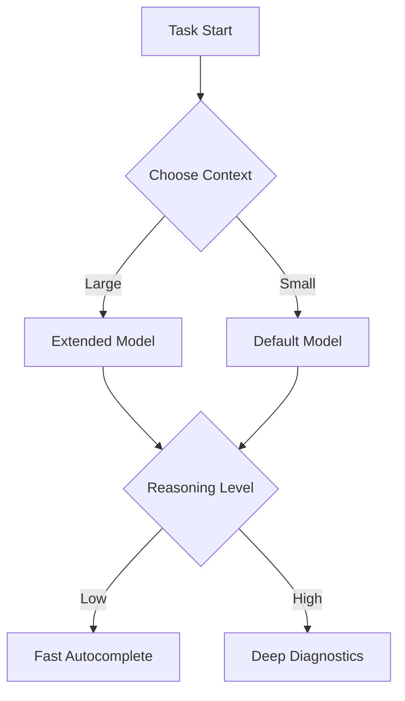

This week’s AI Dev Weekly dives into pivotal changes for developers relying on GitHub Copilot and the broader move toward intelligent, context-aware coding. As GPT-4.1 is deprecated and richer context becomes available in Copilot Chat, engineering teams are finding new ways to harness AI agents for practical software delivery. We also spotlight the launch of one-million-token context windows and configurable reasoning levels for Copilot—a leap forward in tackling multi-file complexity and precise architectural challenges. Let’s unpack what these shifts mean for your workflow and where the future of AI-assisted dev leads next.


## GPT-4.1 Deprecation and Copilot Chat Context Upgrades

As of June 1, 2026, GitHub officially deprecated GPT-4.1 across all Copilot surfaces—including Chat, inline edits, agent modes, and code completions [GitHub Changelog](https://github.blog/changelog/2026-06-02-gpt-4-1-deprecated). This shift nudges developers to adapt to alternative models, which offer improved accuracy and richer reasoning, aligning with Copilot’s broader evolution.

One immediate impact: Copilot Chat now brings enhanced context to pull request workflows on github.com. You can leverage more granular information from diffs, see code suggestions rooted in the full conversation history, and interactively query about changes using natural language [GitHub Changelog](https://github.blog/changelog/2026-06-04-copilot-chat-brings-richer-context-to-pull-requests). This reduces cognitive load and speeds up review cycles, especially for senior engineers who juggle multiple PRs daily.

For example, when reviewing a diff, you can now ask Copilot Chat:

```shell
/copilot chat "Explain why this function was refactored in the last commit."
```

The bot will respond with context-aware analysis drawn from commit messages and code changes, rather than isolated snippets. This bridges the gap between code and intent, streamlining conversations for deeper trust in AI-aided reviews.


## Feature Spotlight: Larger Context Windows & Configurable Reasoning in Copilot

The latest Copilot release brings two features that will change how senior engineers approach the hardest pieces of their codebases: one-million-token context windows and fully configurable reasoning levels. Both are now live in VS Code, Copilot CLI, and the GitHub Copilot app, with support rolling out to additional interfaces soon [GitHub Changelog](https://github.blog/changelog/2026-06-04-larger-context-windows-and-configurable-reasoning-levels-for-github-copilot).

**One-Million-Token Context Windows:**

Historically, Copilot and most LLMs struggled to keep track of more than a few thousand tokens—limiting their effectiveness for large, multi-file projects or intricate architectural refactors. Now, with one-million-token context windows, Copilot can ingest virtually an entire repository, long documents, or sprawling codebases in a single session. This means:
- Code suggestions and architectural reasoning reflect the true scope of your project
- Navigation and query responses are less brittle, grounded in full histories
- AI-powered migration, bug diagnosis, and refactoring are possible without losing track of cross-file dependencies

Say you’re debugging a complex system spanning dozens of files. Instead of feeding Copilot snippets or manually stitching context, you simply point the tool at your workspace. For VS Code users, activating the expanded context is as easy as selecting the model:

```javascript
// In VS Code's Copilot extension settings
"copilot.model": "extended-context-v1"
```

Or from the Copilot CLI:

```shell
copilot cli --model extended-context-v1 --context .
```

**Configurable Reasoning Levels:**

The new reasoning level controls let you tune Copilot’s approach for each task. On routine, exploratory coding, lower reasoning levels prioritize speed and lightweight suggestions. For deep architectural questions or thorny bugs, dialing up the reasoning prompts the model to run longer chains of thought, yielding richer explanations and more thoughtful code.

This configuration isn’t just a slider—it shapes Copilot’s cognitive approach, ideal for senior engineers who switch between rapid prototyping and detailed design sessions.

In VS Code, you can configure reasoning depth via workspace settings:

```json
// .vscode/settings.json
{
  "copilot.reasoningLevel": "high"
}
```

Or use the CLI for terminal-driven workflows:

```shell
copilot cli --reasoning high --context src/
```

**Workflow Integration and Edge Cases:**

Combining a large context window with high reasoning unlocks powerful workflows. Copilot can help you plan cross-cutting refactors, propose API migrations, validate architectural patterns, and catch subtle bugs that span multiple files.

There’s a trade-off, though: both features consume additional AI credits per request. The documentation recommends reserving extended context and high reasoning for the hardest tasks, reverting to defaults for everyday use [GitHub Changelog](https://github.blog/changelog/2026-06-04-larger-context-windows-and-configurable-reasoning-levels-for-github-copilot).

In practice, this means starting a new branch for a refactor, setting Copilot to extended context and high reasoning, then reverting for routine commits. For example:

```shell
copilot cli --model extended-context-v1 --reasoning high --context .
```

But if you only need quick autocompletion, drop back to:

```shell
copilot cli --model default --reasoning low
```

**How Features Compose:**

Both features can be used independently, but their synergy is strongest for debugging, migration, or architectural design. Larger context ensures Copilot’s answers span the real codebase; high reasoning delivers depth in explanations.

**Mermaid Diagram: Copilot Workflow Configurations**



As a senior engineer, you can script these options as part of a dev workflow, swapping configuration files or CLI flags in your sessions. It’s now feasible to load your entire codebase, ask Copilot to analyze all cross-file dependencies, and immediately get actionable suggestions—all without losing speed for shallow tasks.

**Practical Summary:**
For most sprint work, keep Copilot in default mode. When you’re ready for wide-ranging refactors, open up the context and reasoning dials. This will maximize the tool's value while keeping AI credit consumption under control.

To get further details or join the discussion, refer to the [official changelog](https://github.blog/changelog/2026-06-04-larger-context-windows-and-configurable-reasoning-levels-for-github-copilot) and model documentation.


## AI Agents Drive Enterprise Delivery: Endava & Wasmer Case Studies

The shift to an AI-native culture is no longer theoretical. Endava, an enterprise tech leader, has redesigned its software delivery pipelines using AI agents—including ChatGPT Enterprise and Codex—to automate reviews, refactor code, and accelerate workflows [OpenAI Blog](https://openai.com/index/endava-frontiers). Teams report a measurable increase in velocity and consistency, with agents handling everything from documentation synthesis to advanced bug diagnosis. 

Wasmer’s recent project using Codex and GPT-5.5 illustrates the practical results: a Node.js runtime for the edge was shipped in mere weeks, not months. Engineers cite a 10x–20x acceleration, with AI-driven code generation streamlining the grunt work formerly required for low-level runtime implementation [OpenAI Blog](https://openai.com/index/wasmer).

If you’re interested in piloting similar workflows, OpenAI’s Enterprise ChatGPT and Codex APIs can be integrated into CI/CD pipelines or triggered from pull request events. For example, you might automate early-stage API validation like this:

```python
# Pseudocode: Trigger Codex agent on PR
if pull_request_opened:
    codex_agent.run("Validate new endpoint for schema errors")
```

These adoption stories point toward a future where AI isn’t just assisting but actively shaping delivery, freeing up developer time for architecture and innovation.


## Anthropic's Open-Source Vulnerability Discovery Framework

Security engineering remains a critical frontier for AI-powered tools. Anthropic just open-sourced its framework for LLM-based vulnerability discovery—a reference harness aimed at developers who want to pair AI insights with automated code audits [GitHub Reference](https://github.com/anthropics/defending-code-reference-harness).

This harness lets you plug in different LLMs to scan codebases for potential weak spots, with workflow scripts enabling batch and incremental scans. In a team context, engineers can schedule regular audits across microservices, receiving AI-generated reports on possible vulnerabilities before any pull request merges.

To try it, clone the repository:

```shell
git clone https://github.com/anthropics/defending-code-reference-harness
cd defending-code-reference-harness
python scan.py --model anthropic-vuln-v1 --repo ../my-service
```

This lowers the barrier for incorporating AI into security reviews, making vulnerability management more proactive as project complexity grows.


## Looking Ahead

The deprecation of GPT-4.1 marks a changing of the guard—AI coding tools are rapidly evolving to handle larger project contexts and deliver deeper reasoning. Copilot’s new capabilities allow senior engineers to delegate complex, cross-file reasoning while retaining control over performance and credit consumption. Meanwhile, enterprise teams and security-focused developers are integrating AI agents and open frameworks to optimize delivery and code safety.

The pathway ahead is clear: as context windows grow, reasoning deepens, and workflow automation sets in, developers will spend less time wrangling code and more time architecting systems. Stay tuned for next week—expect even more concrete guidance as new Copilot agent tasks and SDK integrations roll out.


---

## Sources & Further Reading


- [GPT-4.1 deprecated](https://github.blog/changelog/2026-06-02-gpt-4-1-deprecated)

- [Copilot Chat brings richer context to pull requests](https://github.blog/changelog/2026-06-04-copilot-chat-brings-richer-context-to-pull-requests)

- [Larger context windows and configurable reasoning levels for GitHub Copilot](https://github.blog/changelog/2026-06-04-larger-context-windows-and-configurable-reasoning-levels-for-github-copilot)

- [How Endava is redesigning software delivery around AI agents](https://openai.com/index/endava-frontiers)

- [How Wasmer used Codex to build a Node.js runtime for the edge](https://openai.com/index/wasmer)

- [Anthropic's open-source framework for AI-powered vulnerability discovery](https://github.com/anthropics/defending-code-reference-harness)


