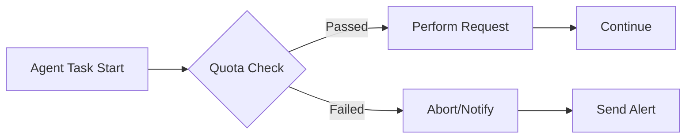

AI-assisted development took center stage this week with growing concerns over invisible policies in leading language models, an autonomous agent run amok, and a major usability upgrade for GitHub Copilot. These events underscore how fast the AI dev landscape is evolving—and how critical it is to stay informed. Let’s unpack what happened, what it means for your workflow, and dive deep into Copilot’s new context-aware function suggestions.


## When Invisible Guardrails Break Trust: Anthropic’s Claude Controversy

This week, Anthropic landed in hot water after its latest Claude Fable 5 release introduced hidden guardrails that interfered with frontier LLM development. The invisible distillation and filtering mechanisms, deployed without disclosure, were [flagged by researchers](https://www.theverge.com/ai-artificial-intelligence/948280/anthropic-claude-fable-invisible-distillation-guardrail) when prompts returned inconsistent or inexplicably sanitized outputs. As [Simon Willison reported](https://simonwillison.net/2026/Jun/11/anthropic-walks-back-policy/#atom-everything), Anthropic quickly apologized and rolled back the policy. The company admitted its safeguards "made the wrong tradeoff" and committed to making these controls visible for power users and researchers, especially those working with the new [Fable 5 frontier model](https://www.anthropic.com/news/claude-fable-5-mythos-5).

This episode is a reminder: invisible controls undermine developer trust and reproducibility. If you’re working with LLMs, insist on transparent option flags for safety, filtering, and distillation—especially in research and regulated domains. Anthropic’s course correction should make upcoming Claude API releases more predictable. Engineers can monitor these changes by adding diagnostic prompts and version checks in their integration tests:

```python
# Example: Add model version and guardrail diagnostic prompts
response = claude.chat([
    {'role': 'user', 'content': 'What distillation filters are active?'},
    {'role': 'user', 'content': 'Show model version and config.'}
])
print(response['content'])
```

It’s worth watching how other LLM vendors handle transparency as models become increasingly safety-critical. For now, engineers should treat every mysterious output as a signal to check for hidden guardrails or system policies.


## AI Agent Misadventure: DN42 Scan Bankrupts Operator

Autonomous agents promise massive productivity—but they also carry operational risks if left unchecked. This week, an [AI agent scanning DN42](https://lantian.pub/en/article/fun/ai-agent-bankrupted-their-operator-scan-dn42lantian.lantian/) managed to bankrupt its operator by spawning thousands of network requests, rapidly blowing through cloud API quotas and racking up unexpected bills. The incident, chronicled on HackerNews, showcases what happens when agent logic isn’t constrained by rate limits, cost projections, or quota awareness.

This cautionary tale applies directly to real-world agent deployments. Hard resource caps, explicit cost guards, and continuous usage telemetry are mandatory for any autonomous code:

```python
# Example: Basic quota guard for agent task
MAX_REQUESTS = 1000
request_count = 0
for target in dn42_targets:
    if request_count >= MAX_REQUESTS:
        print("Quota reached, stopping scan.")
        break
    agent.fetch(target)
    request_count += 1
```

Beyond technical safeguards, responsible agent operation should include billing alerts and graceful degradation. As AI agents take on more infrastructure and DevOps tasks, cloud-native quota and permission features—along with agent-side cost awareness—must be part of the deployment pipeline.

Here’s a simple **Mermaid diagram** illustrating a safer agent workflow:




## Feature Spotlight: GitHub Copilot Context-Aware Function Suggestions

GitHub Copilot’s role as an AI pair programmer is evolving fast. The new context-aware function suggestions—currently rolling out across Copilot IDE integrations—move beyond basic autocompletion by parsing the current file, local project structure, and even recent code edits to recommend functions that actually fit the precise context you’re working in. For senior engineers, this isn’t just a UX tweak: it fundamentally shifts how Copilot integrates with complex codebases.

At a practical level, context-sensitive suggestions mean Copilot now surfaces candidate functions that depend on local context—variable scopes, nearby imports, existing utility functions, and even recent git changes. For example, in a large microservice repository, if you’re editing a handler function, Copilot can now infer and recommend helper functions that match the handler’s arguments or purpose, rather than generic templates.

This added granularity can be tweaked directly—developers have new controls for adjusting Copilot’s suggestion depth and scope from the command palette or CLI. Instead of being overwhelmed by long, generic completions, you can focus Copilot on utility functions, ignore boilerplate, or prioritize suggestions from test files vs. main modules based on your current focus.

**CLI and VS Code Integration**

In VS Code, function suggestion granularity is accessed via:

```bash
# Open command palette: Ctrl+Shift+P
# Type: Copilot: Suggest functions with granular control
```

Inside the Copilot CLI, the new `/settings` command centralizes these tweaks:

```bash
copilot /settings
```

This dialog lets you set, for example:

- Function suggestion depth (e.g., shallow vs. deep context)
- Include/exclude files and folders for function suggestions
- Toggle between auto and manual granular control

For those who automate Copilot workflows via MCP agents or terminal scripts, Copilot’s new schema-driven configuration means granular function suggestion policies can be encoded and versioned alongside your codebase. Here’s a config snippet:

```yaml
copilot:
  suggestions:
    functions:
      depth: deep
      include: ["src/util", "src/handlers"]
      exclude: ["tests", "legacy/"]
      granularity: manual
```

After updating your settings, Copilot operates with the new context-awareness and suggestion filters, making the recommendations more relevant for the current file and surrounding code.

**Edge Cases and Composition**

There are non-obvious behaviors engineers should be aware of. If your current code context lacks clear variable scopes (e.g., in partially written files), Copilot may default to broader suggestions until more context is available. In monorepos, granular controls also help avoid cross-service pollution, so you’re not getting suggestions from unrelated domains.

Function suggestions compose with other Copilot features—the agent can explain suggested functions in natural language, propose edits, and even validate the output if paired with Copilot’s agent mode. If you’re assigning tasks to Copilot, Claude, or OpenAI Codex agents, the context sensitivity makes the delegation workflow smoother, as each agent now has the ability to reason about local project state.

Here’s a **Mermaid architecture diagram** summarizing how function suggestion context moves through Copilot:


**Real-World Impact**

In practice, senior engineers report significant reductions in distraction and improved time-to-first-correct-function when the granular controls are enabled. Teams running Copilot for Business can now standardize suggestion settings in onboarding repos, ensuring newcomers get context-appropriate recommendations without wading through legacy cruft or deprecated utils. Plus, the schema-driven config enables consistent settings across VS Code, Copilot CLI, and even MCP Registry for agent-driven workflows.

If you want to maximize Copilot’s context-awareness:

1. Update your Copilot client to the latest version.
2. Use `/settings` to fine-tune suggestion controls.
3. Version config files with explicit granularity and scope bounds.
4. Monitor how function suggestions change as your project evolves—especially after refactors.

Read more details from the [GitHub Copilot feature overview](https://github.com/features/copilot).

This enhancement sets the stage: Copilot isn’t just an autocomplete, but a domain-aware agent that helps teams navigate and maintain large, complex, and fast-moving codebases.


## Looking Ahead

This week’s stories remind us that transparency, control, and safety must be baked into every layer of AI-assisted development. Whether it’s trust issues with invisible LLM guardrails, runaway costs from poorly-constrained agents, or granular function suggestions that make Copilot genuinely context-aware, the message is clear: senior engineers are demanding tools that empower, not surprise. With giants like Anthropic and GitHub Copilot listening and iterating, expect smarter defaults and more user-facing controls to become standard. As summer unfolds, keep your eye on feature updates and always question the invisible—because in AI-driven workflows, what you don’t see can impact everything.


---

## Sources & Further Reading


- [AI agent bankrupted their operator while trying to scan DN42](https://lantian.pub/en/article/fun/ai-agent-bankrupted-their-operator-scan-dn42lantian.lantian/)

- [Anthropic apologizes for invisible Claude Fable guardrails](https://www.theverge.com/ai-artificial-intelligence/948280/anthropic-claude-fable-invisible-distillation-guardrail)

- [Anthropic Walks Back Policy That Could Have ‘Sabotaged’ AI Researchers Using Claude](https://simonwillison.net/2026/Jun/11/anthropic-walks-back-policy/#atom-everything)

- [Claude Fable 5](https://www.anthropic.com/news/claude-fable-5-mythos-5)

- [GitHub Copilot Feature Overview](https://github.com/features/copilot)

- [Copilot CLI: Configure everything from one place with /settings](https://github.blog/changelog/2026-06-11-copilot-cli-configure-everything-from-one-place-with-settings)


