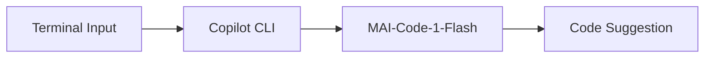
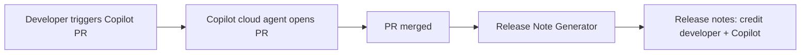

From the way we credit collaborative coding agents to the spread of purpose-built small language models, AI is reshaping developer productivity in subtle but impactful ways. This week, GitHub deepens Copilot's integration into release notes, rolling out a feature that makes AI-assisted contributions more visible and accountable. At the same time, MAI-Code-1-Flash is now accessible in more places developers work, marking a significant shift toward lighter, faster coding models. OpenAI, meanwhile, continues to fine-tune enterprise AI adoption with new spend and usage controls. Let’s jump in to see how these changes affect your daily workflow.


## MAI-Code-1-Flash Arrives Across Copilot Surfaces

Microsoft’s MAI&#8209;Code&#8209;1&#8209;Flash, their compact coding model, has now landed on a wider range of GitHub Copilot surfaces, including Copilot CLI, Copilot app, and Copilot Chat—bringing faster, lighter code generation where developers need it most ([source](https://github.blog/changelog/2026-06-18-mai-code-1-flash-available-on-more-copilot-surfaces)).

Unlike larger foundation models, MAI-Code-1-Flash is optimized for speed and minimal resource consumption, making it ideal for CLI and chat-driven workflows. If you’re using Copilot CLI, the switch happens seamlessly; expect command completions and quick code suggestions even in low-latency environments.

To see the model in action, try a shell workflow like:

```shell
copilot suggest 'Write a bash script to backup ~/projects to ~/archive'
```

Developers executing commands via the Copilot CLI or coding inside the Copilot app will now notice snappier response times, and those working in restricted resource scenarios (such as limited containers or edge devices) should see practical uplift.

Here's how a typical workflow looks when MAI-Code-1-Flash is triggered:



For teams already invested in Copilot chat or app integrations, this expansion allows broader testing and feedback, especially where latency or model size constraints are critical. Keep an eye out: Microsoft is also nudging Copilot surfaces to incrementally favor these performance-tuned models before larger alternatives by default.


## OpenAI Makes Usage Analytics and Spend Controls Enterprise-Ready

Cost and visibility are perennial pain points for enterprises deploying AI tools at scale. OpenAI just announced improved spend controls and usage analytics for ChatGPT Enterprise ([source](https://openai.com/index/chatgpt-enterprise-spend-controls)), helping organizations track AI consumption and manage budget boundaries.

These tools provide granular usage breakdowns and let admins set spend limits in real time, reducing the risk of uncontrolled consumption. If you’re managing a fleet of engineers using GPT-powered code review or brainstorming, the new analytics dashboards and controls let you identify where most usage originates, optimize license distribution, and track which teams push limits.

For example, admins can:

- Set a monthly spend cap per group.
- View usage heatmaps by team or end user.
- Get alerts before limits are breached.

This update brings enterprise AI closer to parity with standard SaaS management, making ChatGPT more viable for large-scale development teams. Command-line managed environments can use the API hooks for tighter integration:

```python
import openai
openai.ChatGPT.usage.summary(organization="my-org")
```

For teams leveraging ChatGPT in code review or doc generation, these improvements translate to more predictable cost and easier scaling.


## Feature Spotlight: Copilot Credits You for AI-Assisted Pull Requests

GitHub’s latest update introduces automatic author crediting for Copilot-generated pull requests in release notes, closing a long-standing gap in how AI-assisted contributions are recognized ([source](https://github.blog/changelog/2026-06-18-generated-release-notes-credit-you-for-copilot-pull-requests)). Previously, when Copilot cloud agent created a pull request for you, merged PRs showed the Copilot bot as the sole author, making attribution unclear.

Now, generated release notes smartly attribute the developer who initiated Copilot’s action. Instead of seeing:

```
Add create_feature_flag MCP tool by @copilot
```

You’ll now see:

```
Add create_feature_flag MCP tool by @monalisa with @copilot
```

This distinction is more than cosmetic: it ensures transparent credit for contributions where Copilot assists but doesn’t own the context or intent. For senior engineers juggling multiple PRs and agent-driven automation, this clarity is vital for both accountability and performance tracking.

The feature is seamless. When you trigger Copilot to open a PR (for example, via Copilot CLI or chat agent), the system records your GitHub identity as the initiator, tagging you in release notes alongside Copilot. This matters especially in hybrid workflows, where human guidance shapes the AI’s output, but procedural steps (like opening PRs) are delegated to the agent.

Consider a workflow where Copilot automates mundane repo updates, such as dependency bumps or refactoring, and you review before merging. For release managers and team leads, the new credit system pinpoints who shaped changes (vs. who operated automation), streamlining retrospective reviews.

Behind the scenes, GitHub’s release note generator pulls from PR metadata, cross-referencing Copilot’s agent ID and the original requestor. This applies regardless of repository size, team structure, or Copilot plan (“all repositories on GitHub and all plans”).

**Integrating Into Your Release Process**

If you’re already using GitHub’s automated release notes, you don’t need to change config or workflow. The feature is enabled platform-wide; simply merge Copilot-driven PRs as usual and generate release notes:

```shell
git checkout main
git pull origin main
github release create --generate-notes
```

Generated notes now include dual attribution for Copilot-driven PRs. For manual workflows or custom generators leveraging GitHub’s release API, you’ll see the change in the `author` and `assistant` fields of PR objects, making it easier to post-process or filter contribution types.

**Edge Cases and Non-Obvious Behavior**

- If a PR is initiated by Copilot but edited by another user before merge, credit still flows to the original requester, with Copilot noted as agent.
- Large repos with many automated PRs now see less noise: reviewers can distinguish between agent-only and agent-assisted work.
- The system is robust to bulk merges and cherry-picks; even when multiple Copilot PRs are merged together, credits are resolved per original action.

**How It Composes With Other Copilot Features**

The author-credit integration builds atop Copilot cloud agent’s recent envelope, tying into agent finder and Copilot-authored PR searches (docs). For teams leveraging “release notes with AI” and “agent-driven PR searches”, this additive layer creates traceable provenance for every automated change.

Release note generation is now a powerful accountability tool, enabling leads to:

- Audit who used Copilot for bulk refactoring or dependency pulls.
- Generate reports separating human, AI-assist, and bot-only contributions.
- Improve team onboarding by showing new devs their Copilot-assisted work is visible and recognized.
- Optimize workflows: assign reviews based on agent-handoff, clarify change intent, and reduce manual credit sifting.

**Practical Impact and Takeaways**

For senior engineers or release managers, the change is a quiet revolution. It eliminates attribution ambiguity, speeds up retrospectives, and lights up visibility on hybrid contribution. AI-assisted workflows gain a layer of trust and transparency, crucial for regulated environments or open source collaboration.

Here’s a visual overview:



In summary: if Copilot opens a PR for you, you’re now recognized alongside Copilot in release documentation, adding traceability to human-AI teamwork and freeing you from tedious manual note edits.


## Opus 4.6 Fast Deprecation: What To Expect

GitHub is sunsetting the Opus 4.6 (fast) model across Copilot experiences, with June 29, 2026 as the cutoff ([source](https://github.blog/changelog/2026-06-18-upcoming-deprecation-of-opus-4-6-fast)). If you’re using Copilot Chat, inline edits, or agent mode and rely on Opus 4.6 (fast), you’ll want to prepare for the transition. The deprecation is part of a broader shift toward more purpose-built, performance-optimized models like MAI-Code-1-Flash.

Dev teams should:

- Audit current workflows for any explicit Opus 4.6 (fast) targeting.
- Update integrations to reference default Copilot models, which will now auto-select best-fit engines.

For plugin or API-based contexts, check code for hardcoded model parameters:

```python
model='opus-4.6-fast'  # Update this to the default or new supported model
```

Failure to update may result in fallback to slower or less performant models. Monitor Copilot platform updates for guidance on replacement models as rollout completes.


## Looking Ahead

This week’s changes underline two major themes: AI is rapidly becoming an invisible assistant in developer workflows, and recognition mechanisms are catching up to hybrid human-machine work. With Copilot’s new credit system, senior engineers gain actionable transparency to track and audit contributions—an especially big win for larger teams and regulated projects. Meanwhile, the spread of MAI-Code-1-Flash heralds an era of small, fast models surfacing across more contexts, reducing friction in AI-aided coding. OpenAI’s enterprise analytics step up cost and usage visibility, while the deprecation of legacy models clears space for more tuned alternatives. As these tools evolve, expect even tighter integration between human context, AI automation, and accountability. Next week: will workflow provenance and fine-grained crediting make it into compliance audits, or will AI agents begin to generate narratives for their own actions? Stay tuned.


---

## Sources & Further Reading


- [MAI-Code-1-Flash available on more Copilot surfaces](https://github.blog/changelog/2026-06-18-mai-code-1-flash-available-on-more-copilot-surfaces)

- [Upcoming deprecation of Opus 4.6 (fast)](https://github.blog/changelog/2026-06-18-upcoming-deprecation-of-opus-4-6-fast)

- [Generated release notes credit you for Copilot pull requests](https://github.blog/changelog/2026-06-18-generated-release-notes-credit-you-for-copilot-pull-requests)

- [New usage analytics and updated spend controls for enterprises](https://openai.com/index/chatgpt-enterprise-spend-controls)


