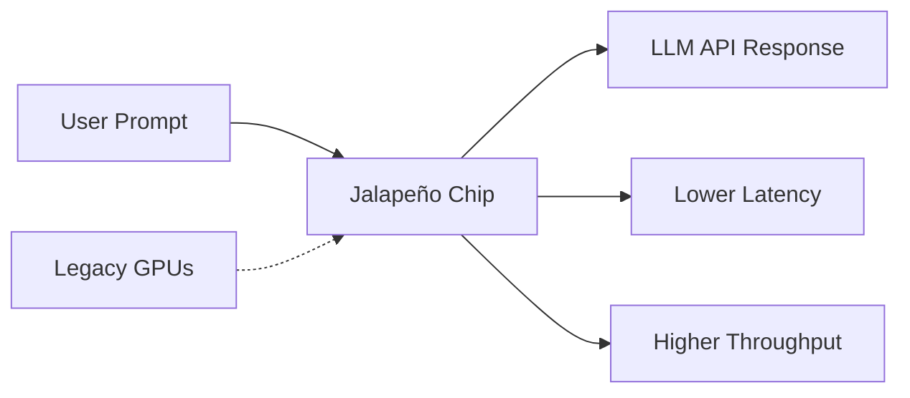
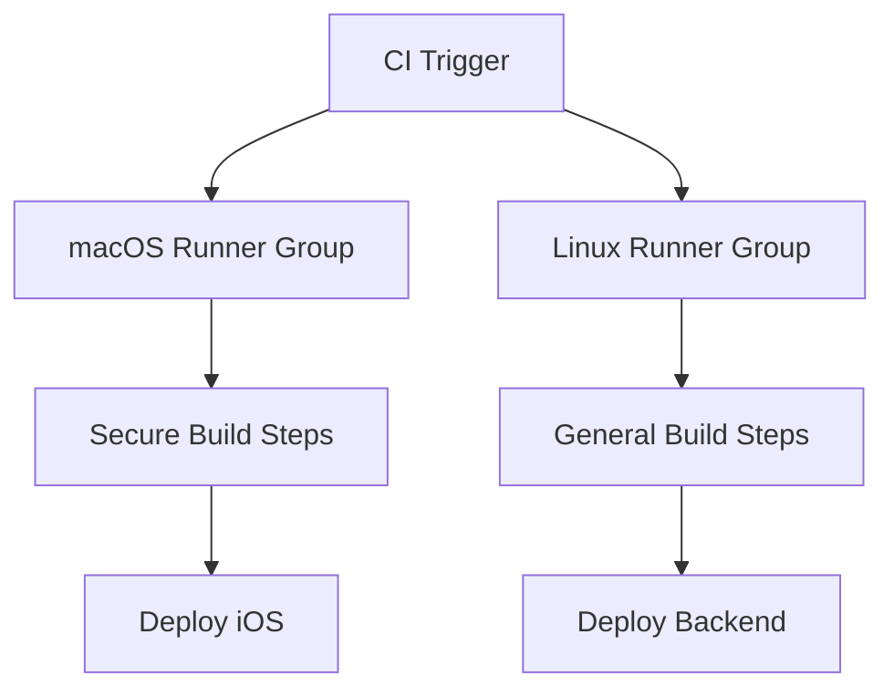

AI-assisted software development is moving from hype to hard infrastructure. This week’s news reveals landmark moves: OpenAI’s first custom chip, Anthropic’s security friction, and—critically—new controls for GitHub-hosted runners that will change how senior engineers orchestrate DevOps at scale. Let’s dive into what’s shaping the practical foundations of AI-driven development environments.


## Anthropic Security Drama: Model Extraction Risks Go Mainstream

Security remains a critical concern in the world of AI, especially as foundation models are increasingly adopted in enterprises. This week, [Anthropic accused Alibaba](https://www.reuters.com/world/china/anthropic-says-alibaba-illicitly-extracted-claude-ai-model-capabilities-2026-06-24/) of illicit model extraction, alleging that Alibaba engineers managed to extract capabilities from the Claude AI model without authorization. 

For developers, this highlights the real-world threat of model misappropriation—a risk that goes way beyond training data leaks. Teams deploying proprietary LLMs or leveraging third-party APIs must ensure robust access controls, tenancy isolation, and audit trails for their inference endpoints. Strong API keys and request validation are essential, but in high-value deployments, it’s worth also considering encrypted transport and response watermarking where possible. 

While Anthropic hasn't released technical details, most model extraction attempts hinge on excessive querying or subtle API misuse. Defensive strategies include throttling requests, monitoring for anomalous traffic, and running regular security reviews to spot suspicious patterns.


## OpenAI’s Custom LLM Chip: Jalapeño Hits the Hardware

Performance bottlenecks in LLM-powered tools have always been a pain point—both for developers and platform teams. This week, OpenAI and Broadcom [unveiled Jalapeño](https://openai.com/index/openai-broadcom-jalapeno-inference-chip), their first custom inference chip engineered specifically for LLM workloads. By optimizing for token throughput and power consumption, Jalapeño aims to make LLM queries faster and more scalable for everything from chatbots to code generation engines.

Unlike previous AI chips focused on training, Jalapeño is tuned for inference, handling massive prompt loads with lower latency. For developers, this should translate into snappier API responses, more predictable CI/CD runs, and the possibility of running larger context windows without degraded performance. 

Early benchmarks aren’t public yet, but OpenAI claims system-wide improvements for organizations using the new hardware. Expect to see Jalapeño-backed endpoints in OpenAI’s enterprise API offerings soon.




## Feature Spotlight: More Control Over Your GitHub-Hosted Runners

GitHub Copilot and Actions have become central to CI/CD pipelines, but until this week, organizations had little control over the nuances of how hosted runners performed, especially when juggling complex workflows and capacity management at scale. The latest [runner control update](https://github.blog/changelog/2026-06-25-more-control-over-your-github-hosted-runners) brings granular runner group management—including for macOS runners—and new policies for job routing, concurrency, and security. Let’s dig in.

**Fine-Grained Runner Permissions**

Admins can now restrict who can use GitHub-hosted runners, not just by repository but through runner groups assigned to specific teams, orgs, or workflows. This lets you enforce compliance (e.g., only trusted engineers may access sensitive macOS environments), while preventing accidental resource monopolization.

For example, to create a runner group for the iOS team:

```yaml
# .github/workflows/ios-tests.yml
jobs:
  build:
    runs-on: runner-group:ios-team
    steps:
      - uses: actions/checkout@v4
      - name: Build iOS App
        run: xcodebuild ...
```

You can now reference runner groups by name, directing jobs to the exact macOS runners intended for them.

**Enforcing Concurrency Limits**

Concurrency limits allow admins to cap simultaneous jobs—mitigating runaway parallelization in high-velocity teams. Place a ceiling on macOS jobs, so critical workflows aren’t starved.

Configuring concurrency at the group level, via the GitHub UI:

- Navigate to `Settings > Actions > Runner groups`
- Edit your macOS group, then specify `Max concurrent jobs`

If you max out concurrency, additional jobs wait in queue, ensuring cost control and reducing flake risk.

**Disable Standard Hosted Runners (e.g., ubuntu-latest)**

Previously, anyone could launch jobs on GitHub’s default runners. Now, admins can disable standard labels like `ubuntu-latest`, effectively forcing jobs to use only approved runner groups. This is crucial for environments with stricter compliance requirements or dedicated hardware.

To disable standard runners:

- At the organization level, go to `Settings > Actions > Runner groups > Disable standard runners`

This move pushes teams to migrate their workflow `runs-on` entries to named runner groups, potentially requiring mass refactors of existing workflow yaml files.

**Policy-Based Routing for macOS Runners**

macOS runners now support policy-based access control, letting you specify which orgs, repos, or workflows can use specific runners. This is useful for handling secret key material, proprietary build steps, or licensing-constrained tooling.

A conditional snippet for routing:

```yaml
runs-on: runner-group:secure-mac
if: github.actor == 'trusted-engineer'
```

**Edge Cases and Practical Implications**

- Network configurations aren’t supported for macOS runners yet, so teams reliant on custom VPCs will need to wait.
- If you disable standard hosted runners, any workflow referencing `ubuntu-latest` or `macos-latest` without a runner group will fail to start; widespread changes are needed across repos.
- Policy enforcement can lead to confusing errors if runner group assignments are misconfigured—`Runner group not found` is a common gotcha when renaming groups or migrating workflows.

**Composability**

These features compose well with recent Copilot CLI improvements (e.g., richer parallel steps, custom RedHat runner images, and improved workflow triggers). Senior engineers can now define hybrid pipelines: routing sensitive builds through tightly controlled macOS groups, while general jobs run on cheaper, shared pools.

Here’s a simplified pipeline flow:



**Summary for Senior Engineers**

Runner group controls unlock a new level of CI/CD security and stability, especially in multi-team organizations. The practical impact is clear: fewer workflow collisions, easier compliance audits, and predictable billable usage. Migrating to runner groups will require refactoring and careful policy configuration—but the payoff is robust, resilient DevOps.

For full docs and implications, check the [GitHub changelog](https://github.blog/changelog/2026-06-25-more-control-over-your-github-hosted-runners) and runner groups documentation.


## Looking Ahead

AI dev infrastructure is changing fast: hardware innovations, security hardening, and platform controls are converging. If you’re responsible for LLM-powered apps or complex CI/CD, now is the time to review your deployments for both performance and risk posture. Runner group management on GitHub Actions and LLM inference chips like Jalapeño aren’t just marginal upgrades—they’re foundational shifts in how teams build, secure, and scale AI-powered systems. Looking forward, expect more granular controls and hardware acceleration to become table stakes for enterprise dev teams.


---

## Sources & Further Reading


- [Anthropic says Alibaba illicitly extracted Claude AI model capabilities](https://www.reuters.com/world/china/anthropic-says-alibaba-illicitly-extracted-claude-ai-model-capabilities-2026-06-24/)

- [OpenAI and Broadcom unveil LLM-optimized inference chip](https://openai.com/index/openai-broadcom-jalapeno-inference-chip)

- [More control over your GitHub-hosted runners](https://github.blog/changelog/2026-06-25-more-control-over-your-github-hosted-runners)


