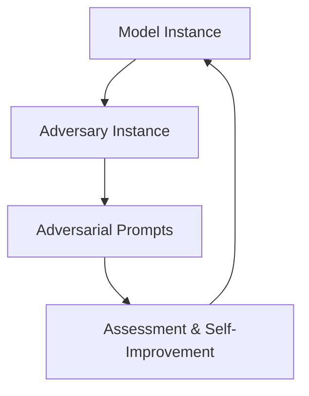
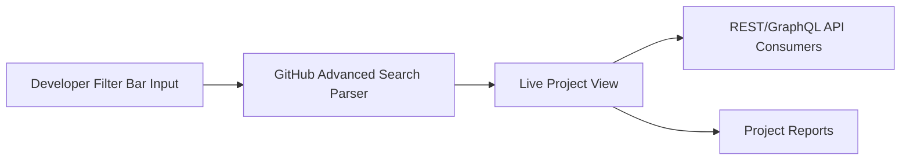

This week’s AI Dev Weekly maps out a critical shift in developer tooling: automation and safety are now intertwined with code navigation and management. OpenAI’s push for self-improvement in large language models, new frameworks for US AI safety, and GitHub Copilot’s advanced project search bring practical changes to how teams build and secure their software. Read on for actionable insights and deep technical dives—especially if you manage a sprawling codebase or wrangle LLM-powered apps.


## GPT-Red: Automated Red Teaming for LLM Robustness

OpenAI just launched [GPT-Red](https://openai.com/index/unlocking-self-improvement-gpt-red), a fully automated red teaming system that taps into self-play to boost LLM robustness, alignment, and resistance to prompt injection. Instead of traditional human red teaming—which can be slow and costly—GPT-Red sets up adversarial scenarios between copies of the model, using these as ‘tests’ to iteratively improve the model’s security and behavior. Practically, this means your LLM-powered applications could see reduced risks and more agile patching for vulnerabilities as models self-identify failure cases and adapt in near real-time.

For developers, the immediate takeaway is enhanced model reliability, especially in security-sensitive apps. The pipeline for GPT-Red can be visualized as:



If you're deploying LLMs, integrate regular adversarial testing and monitor changelogs for prompt injection patches. Consider setting up your own red teaming environments, inspired by OpenAI’s self-play approach, e.g. spawning dual model instances in your testing suite with different prompt injection tactics.


## AI Safety Regulation: Reverse Federalism and Developer Impact

OpenAI’s latest [report](https://openai.com/index/advancing-ai-safety-through-state-and-federal-action) outlines a ‘reverse federalism’ playbook for AI safety: instead of waiting for national regulations, state laws are now driving standards, eventually coalescing into a nationwide framework. This patchwork approach introduces shifting compliance landscapes for AI developers, particularly those working in fintech, healthcare, or education. Organizations need to track state-level laws actively, since these can add friction or requirements affecting model deployment, logging, and data use.

For engineering leads, this means setting up a policy watch mechanism (automated legal feeds, GitHub Actions for compliance checks), and incorporating dynamic configuration based on deployment region. Example: tagging builds based on regulatory mandates for audit trails:

```bash
git tag -a ai-compliance-california -m "Audit logging enabled per CA statutes"
git push origin ai-compliance-california
```

Stay agile by baking state-specific safety checks into your CI pipeline. Early adoption of robust logging, model monitoring, and user feedback loops will pay off as regulatory harmonization evolves.


## Feature Spotlight: GitHub Copilot Advanced Search for Projects

The release of [Advanced Search for Projects](https://github.blog/changelog/2026-07-16-advanced-search-for-projects-is-generally-available) on GitHub Copilot brings a much-requested tool for senior engineers managing extensive project boards or multi-repo initiatives. This is not just a cosmetic change: the filter bar now accepts complex logic—AND/OR operators, PR review filters, and persistent views—meaning you no longer need to maintain a dozen separate boards or lose hours cross-referencing issues.

At its core, advanced search transforms Projects from static dashboards into live, queryable status trackers. Need to zero in on all pull requests reviewed by Alice or Bob **and** still in open status? Just use:

```txt
reviewers:alice OR reviewers:bob AND state:open
```

The logic operators enable compound queries. For example, tracing issues labeled critical and assigned to multiple teams:

```txt
label:critical AND (team:frontend OR team:backend)
```

This depth is crucial when you have sprawling microservices, cross-functional teams, and dozens of concurrent PRs. The feature also introduces review state filters: you can track PRs awaiting review, approved, or changes requested using the `reviews:` filter. 

Consider this workflow for release readiness:

```txt
state:open AND reviews:approved
```

With this, managers can instantly filter for PRs ready for merge, regardless of assignment or repo. Notably, review filters correlate with the Reviewers field, so your results accurately reflect latest feedback and not just who was initially requested.

Another practical implication: the 90-day deployment status retention policy changes data visibility. When running CI/CD dashboards off REST/GraphQL API endpoints, deployment statuses older than 90 days disappear—so for long-lived deployments or compliance auditing, engineers must adjust scripts accordingly. In Python:

```python
import requests

url = "https://api.github.com/repos/org/repo/deployments"
headers = {"Authorization": "Bearer <token>"}

resp = requests.get(url, headers=headers)
for deployment in resp.json():
    # Only process statuses newer than 90 days
    if deployment["created_at"] > threshold_date:
        process(deployment)
```

Edge cases include changes to search syntax. Queries with ill-formed parentheses or mixed AND/OR logic can silently fail or return confusing results. When composing complex filters, always test incrementally and provide backup custom views for users less comfortable with advanced syntax. 

For larger teams, the ability to share presumed views is reduced: your custom filter lives in the session, not as a named shared object. To work around that, document key filters in project README or maintain a markdown cheatsheet for teammates.

Pairing advanced search with Copilot Chat’s semantic issue search unlocks agility in triage. You can now use natural language prompts in Copilot Chat to generate search expressions, e.g.:

```
Prompt: "Show me all PRs by Alice not yet approved"
Returns: 'reviewers:alice AND reviews:pending'
```

Architecture-wise, this upgrades the Projects workflow:



For senior engineers, these improvements are practical facilitators for codebase management, release readiness, and cross-team collaboration. Watch out for the new retention policy and non-obvious search failures, and encourage adoption of advanced queries to drive efficiency in triage cycles.


## Looking Ahead

AI development is increasingly defined by automation, safety, and discoverability. Systems like GPT-Red shift security from human-led cycles to autonomous resilience, while regulatory frameworks force dynamic compliance strategies. Most tangibly, advanced search in GitHub Copilot empowers teams to organize project chaos into streamlined views, boosting productivity and clarity—provided engineers adapt to its new quirks and retention rules. As the foundation of AI dev tooling evolves, expect more synergy between model robustness and tooling features, with smarter search and self-improvement at their core.


---

## Sources & Further Reading


- [GPT-Red: Unlocking Self-Improvement for Robustness](https://openai.com/index/unlocking-self-improvement-gpt-red)

- [The US is advancing AI safety through state and federal action](https://openai.com/index/advancing-ai-safety-through-state-and-federal-action)

- [Advanced search for Projects is generally available - GitHub Changelog](https://github.blog/changelog/2026-07-16-advanced-search-for-projects-is-generally-available)


